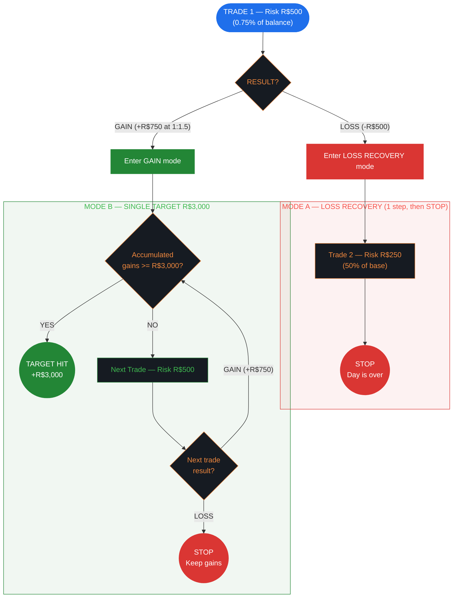
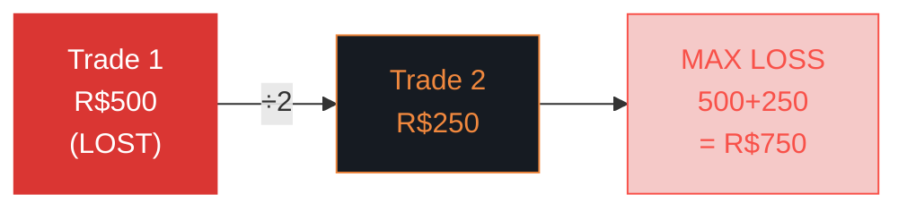
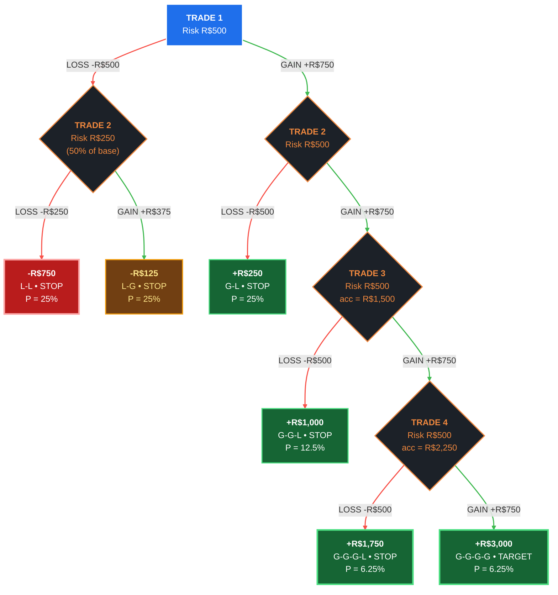

# Fixed Fractional (Van Tharp) — Risk Management Flowchart

> **Limits:** Per Trade R$500 (0.75% of balance) | Daily R$1,000 (2%) | Weekly R$2,500 (5%) | Monthly R$5,000 (10%)
>
> **Sizing:** 0.75% of current balance | **Gain Target:** R$3,000/day | **Author:** Van Tharp

---

## 1. Strategy Overview & Philosophy

**Fixed Fractional** is the most widely taught position sizing method in trading. Popularized by **Van Tharp** in *Trade Your Way to Financial Freedom*, it prescribes risking a fixed percentage of your current account balance on each trade.

**Core principle:** As your account grows, your position size grows proportionally. As it shrinks, you automatically reduce exposure — a built-in anti-martingale mechanism.

**When to use this strategy:**
- You want a simple, well-understood sizing model
- You have a proven edge (WR 55%+ with R:R >= 1:1.5)
- You prefer steady compounding over aggressive recovery
- You want automatic position scaling with account size

---

## 2. Default Parameters

### Risk Limits

| Scope     | Absolute (R$) | % of Initial Balance |
|-----------|--------------|---------------------|
| Per Trade | R$500        | 0.75%               |
| Daily     | R$1,000      | 2%                  |
| Weekly    | R$2,500      | 5%                  |
| Monthly   | R$5,000      | 10%                 |

### Sizing Mode

**Percent of Balance** — risk 0.75% of current balance per trade.

```
Risk = Balance × 0.0075
Contracts = Risk / (Stop points × Point value)
```

As your balance fluctuates, so does your risk per trade. This creates geometric growth during winning streaks and geometric reduction during drawdowns.

### Gain Target

**Single Target:** R$3,000/day — once accumulated gains reach this level, stop trading.

### Drawdown Control

| Drawdown % | Action       |
|-----------|--------------|
| 10%       | Reduce risk by 50% |

Recovery threshold: 50% (recover half the drawdown before restoring full risk).

### Consecutive Loss Rules

| Consecutive Red Days | Action       |
|---------------------|--------------|
| 3 days              | Reduce risk by 50% |
| 5 days              | Stop trading for the day |

---

## 3. Main Decision Flow



---

## 4. Loss Recovery — Size Reduction Sequence



**Rules:**
- Only **1 recovery trade** after the initial loss
- `stopAfterSequence: true` — after Trade 2, the day is **over**
- Maximum loss: R$500 + R$250 = **R$750** (75% of daily limit)
- This is the most conservative recovery — you never dig deeper

---

## 5. Complete Decision Tree — All Paths (R:R 1:1.5, WR 50%)

> This tree shows **every possible day outcome** from Trade 1 to termination. Left branches = LOSS (red), right branches = GAIN (green). Bottom nodes show the final day P&L, path pattern, and probability.



### All Paths — Complete Table

| #  | Path     | T1      | T2       | T3       | T4       | **Day Result** | Probability | Category     |
|----|----------|---------|----------|----------|----------|---------------|-------------|--------------|
| 1  | L-L      | -R$500  | -R$250   | —        | —        | **-R$750**    | 25.00%      | Max loss     |
| 2  | L-G      | -R$500  | +R$375   | —        | —        | **-R$125**    | 25.00%      | Near breakeven |
| 3  | G-L      | +R$750  | -R$500   | —        | —        | **+R$250**    | 25.00%      | Small win    |
| 4  | G-G-L    | +R$750  | +R$750   | -R$500   | —        | **+R$1,000**  | 12.50%      | Good win     |
| 5  | G-G-G-L  | +R$750  | +R$750   | +R$750   | -R$500   | **+R$1,750**  | 6.25%       | Great win    |
| 6  | G-G-G-G  | +R$750  | +R$750   | +R$750   | +R$750   | **+R$3,000**  | 6.25%       | TARGET HIT   |

> **6 possible outcomes.** The loss side resolves in 2 trades (paths 1-2). The gain side can extend up to 4 trades with each win pushing closer to the R$3,000 target. Risk stays flat at R$500 in gain mode — a single loss always costs exactly R$500 regardless of accumulated gains.

### Expected Value — Full Day

```
E[day] = 0.25(-750) + 0.25(-125) + 0.25(250) + 0.125(1000) + 0.0625(1750) + 0.0625(3000)
       = -187.50 - 31.25 + 62.50 + 125.00 + 109.38 + 187.50
       = +R$265.63

Monthly (22 days): +R$5,844
```

---

## 6. Mode Details

### Loss Recovery (Paths 1-2)

After T1 LOSS, one recovery trade at 50% risk, then STOP. `stopAfterSequence: true` — the day is over regardless of T2's outcome.

- **L-L (25%):** Max loss -R$750. Leaves R$250 buffer below the R$1,000 daily limit.
- **L-G (25%):** Recovery partially offsets T1 loss. Still negative (-R$125).

**E[Loss Mode] = 0.50(-750) + 0.50(-125) = -R$437.50**

### Gain Mode — Single Target R$3,000 (Paths 3-6)

Each win adds R$750 (at R:R 1:1.5). The target requires **4 consecutive wins**. A loss at any point stops the day — you keep accumulated gains minus the R$500 loss on the last trade.

| Win # | Accumulated | Still Needed | P(reaching) at 50% WR |
|-------|------------|-------------|----------------------|
| 1     | R$750      | R$2,250     | 50.0%                |
| 2     | R$1,500    | R$1,500     | 25.0%                |
| 3     | R$2,250    | R$750       | 12.5%                |
| 4     | R$3,000    | R$0 (HIT!)  | 6.25%                |

**E[Gain Mode] = 0.50(250) + 0.25(1000) + 0.125(1750) + 0.0625(3000) = +R$781.25**

---

## 7. Unique Features

### Automatic Position Scaling

The 0.75% sizing means your R$ risk adjusts with your balance:

| Balance   | Risk per Trade | Recovery Risk |
|-----------|---------------|---------------|
| R$50,000  | R$375         | R$187.50      |
| R$66,667  | R$500 (default) | R$250       |
| R$80,000  | R$600         | R$300         |
| R$100,000 | R$750         | R$375         |

This creates **geometric growth** during winning periods and **geometric protection** during drawdowns.

### Drawdown + Consecutive Loss Interaction

The 10% drawdown tier and 3-day consecutive loss rule can compound:

```
Scenario: 3 red days in a row, each losing max -R$750
Day 1: -R$750 (1.13% drawdown)
Day 2: -R$750 (2.25% drawdown, 2 consecutive)
Day 3: -R$750 (3.38% drawdown, 3 consecutive → reduce 50%)
Day 4: Risk now halved: R$250 base, R$125 recovery → max loss R$375
```

The consecutive loss rule kicks in before the drawdown tier (10%), providing an earlier safety net.

---

## 8. Simulation — 3 WR/RR Profiles

### Profile A: Sweet Spot — WR 60%, R:R 1:1.5

**Per-trade:** Win = R$750 | Loss = R$500 | PF = 1.80

#### Loss Recovery Paths

| Path | T1     | T2       | **Result**  | Prob   |
|------|--------|----------|------------|--------|
| L-L  | -R$500 | -R$250   | **-R$750** | 40.0%  |
| L-G  | -R$500 | +R$375   | **-R$125** | 60.0%  |

**E[Loss Mode] = 0.40(-750) + 0.60(-125) = -R$375.00**

#### Gain Mode Paths (need 4 wins for R$3,000)

| Path       | Result       | Probability |
|------------|-------------|-------------|
| 1W, 1L     | **+R$250**  | 40.00%      |
| 2W, 1L     | **+R$1,000**| 24.00%      |
| 3W, 1L     | **+R$1,750**| 14.40%      |
| 4W (target)| **+R$3,000**| 12.96%      |

**E[Gain Mode] = 0.40(250) + 0.24(1000) + 0.144(1750) + 0.1296(3000) = +R$981.68**

#### Daily Expected Value

```
E[day] = 0.60 × R$981.68 + 0.40 × (-R$375.00) = +R$439.01
Monthly (22 days): +R$9,658
```

---

### Profile B: Borderline — WR 50%, R:R 1:1

**Per-trade:** Win = R$500 | Loss = R$500 | PF = 1.00

#### Loss Recovery Paths

| Path | T1     | T2       | **Result**  | Prob   |
|------|--------|----------|------------|--------|
| L-L  | -R$500 | -R$250   | **-R$750** | 50.0%  |
| L-G  | -R$500 | +R$250   | **-R$250** | 50.0%  |

**E[Loss Mode] = 0.50(-750) + 0.50(-250) = -R$500.00**

#### Gain Mode Paths (need 6 wins for R$3,000)

| Path       | Result       | Probability |
|------------|-------------|-------------|
| 1W, 1L     | **+R$0**    | 50.00%      |
| 2W, 1L     | **+R$500**  | 25.00%      |
| 3W, 1L     | **+R$1,000**| 12.50%      |
| 4W, 1L     | **+R$1,500**| 6.25%       |
| 5W, 1L     | **+R$2,000**| 3.13%       |
| 6W (target)| **+R$3,000**| 1.56%       |

**E[Gain Mode] = 0.50(0) + 0.25(500) + 0.125(1000) + 0.0625(1500) + 0.0313(2000) + 0.0156(3000) = +R$406.25**

#### Daily Expected Value

```
E[day] = 0.50 × R$406.25 + 0.50 × (-R$500.00) = -R$46.88
Monthly (22 days): -R$1,031
```

**Negative.** At PF = 1.0 with flat risk, the management overhead (recovery trade at half risk) creates a structural drag.

---

### Profile C: Bad — WR 40%, R:R 1:0.8

**Per-trade:** Win = R$400 | Loss = R$500 | PF = 0.53

#### Loss Recovery Paths

| Path | T1     | T2       | **Result**  | Prob   |
|------|--------|----------|------------|--------|
| L-L  | -R$500 | -R$250   | **-R$750** | 60.0%  |
| L-G  | -R$500 | +R$200   | **-R$300** | 40.0%  |

**E[Loss Mode] = 0.60(-750) + 0.40(-300) = -R$570.00**

#### Gain Mode Paths (need 8 wins for R$3,000)

| Path       | Result       | Probability |
|------------|-------------|-------------|
| 1W, 1L     | **-R$100**  | 60.00%      |
| 2W, 1L     | **+R$300**  | 24.00%      |
| 3W, 1L     | **+R$700**  | 9.60%       |
| 4W, 1L     | **+R$1,100**| 3.84%       |
| 5+W...     | diminishing | <2%         |

**E[Gain Mode] = 0.60(-100) + 0.24(300) + 0.096(700) + 0.0384(1100) + ... ≈ +R$21.60**

#### Daily Expected Value

```
E[day] = 0.40 × R$21.60 + 0.60 × (-R$570.00) = -R$333.36
Monthly (22 days): -R$7,334
```

**Capital destroyer.** Gain mode barely breaks even. Would hit monthly R$5,000 limit in ~15 days.

---

## 9. Quick Reference Card

```
╔══════════════════════════════════════════════════════════════╗
║  FIXED FRACTIONAL (Van Tharp) — QUICK REFERENCE             ║
╠══════════════════════════════════════════════════════════════╣
║                                                              ║
║  SIZING: 0.75% of current balance                            ║
║  BASE RISK: R$500 (at ~R$66,667 balance)                     ║
║                                                              ║
║  TRADE 1 LOST?                  TRADE 1 WON?                 ║
║  ──────────────                 ──────────────                ║
║  1. Trade 2 at R$250 (50%)     1. Gains >= R$3,000? → STOP   ║
║  2. STOP. Day over.            2. Next trade at R$500         ║
║                                3. Lost? → STOP (keep gains)   ║
║  Max loss: R$750               4. Won? → Back to step 1       ║
║                                                              ║
║  DAILY LIMITS         DRAWDOWN CONTROL                       ║
║  ─────────────        ────────────────                       ║
║  Loss:  R$1,000 (2%)  10% DD → reduce 50%                   ║
║  Gain:  R$3,000       Recovery: 50% threshold                ║
║  Weekly: R$2,500 (5%)                                        ║
║  Monthly: R$5,000 (10%)                                      ║
║                                                              ║
║  CONSECUTIVE LOSSES                                          ║
║  ──────────────────                                          ║
║  3 red days → reduce risk 50%                                ║
║  5 red days → stop trading                                   ║
║                                                              ║
╚══════════════════════════════════════════════════════════════╝
```
