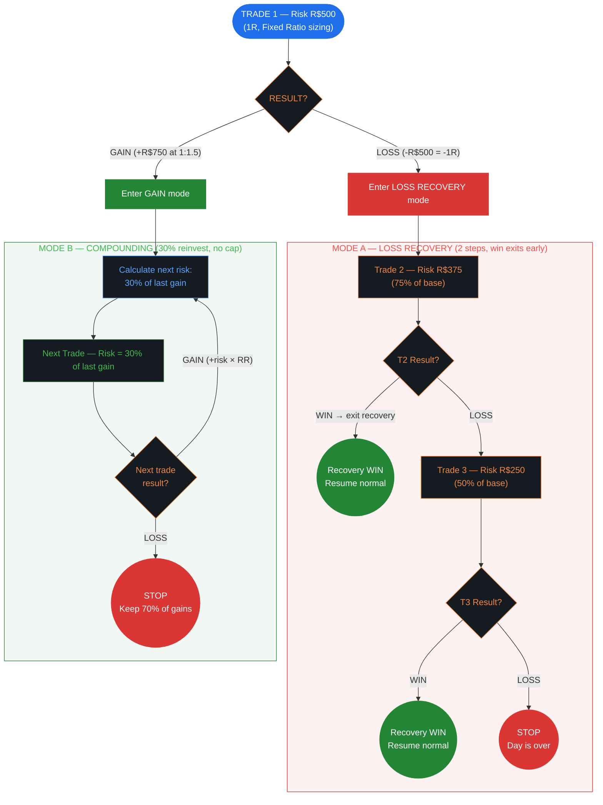
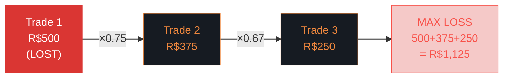
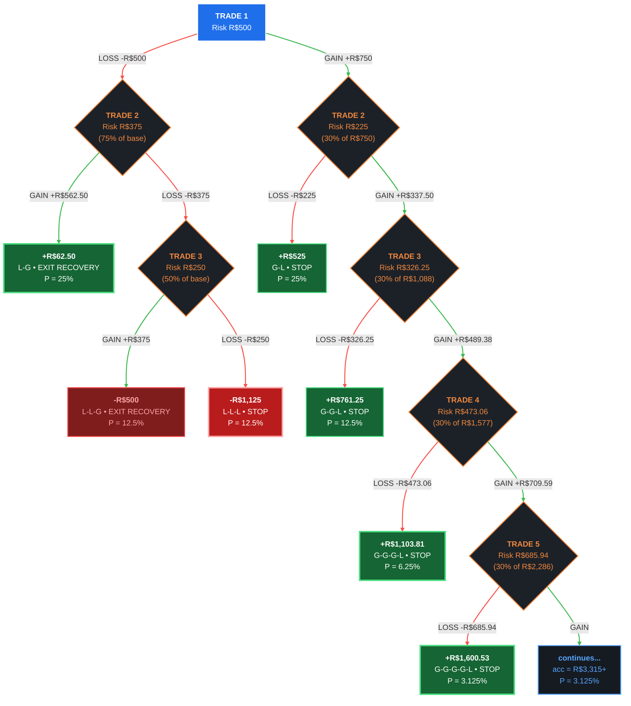
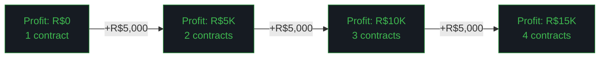

# Fixed Ratio (Ralph Vince) — Risk Management Flowchart

> **Limits:** Per Trade R$500 | Daily 3R (R$1,500) | Weekly 6R (R$3,000) | Monthly 12R (R$6,000)
>
> **Sizing:** Fixed Ratio (delta R$5,000/contract) | **Gain Mode:** Compounding (30% reinvest) | **Author:** Ralph Vince

---

## 1. Strategy Overview & Philosophy

**Fixed Ratio** position sizing was developed by **Ralph Vince**, author of *The Mathematics of Money Management* and *Portfolio Management Formulas*. While Van Tharp's Fixed Fractional risks a fixed % of balance, Vince's approach scales position size based on **accumulated profit** using a "delta" parameter.

**Core principle:** You earn the right to increase position size. Each additional contract (or size unit) requires earning a fixed delta of profit. This creates a natural acceleration curve — slow at the start, faster as profits accumulate — without the wild swings of percent-of-balance sizing.

**Key difference from Fixed Fractional:**
- Fixed Fractional: risk = % of current balance (immediate adjustment)
- Fixed Ratio: contracts = f(total profit / delta) — stepped increases based on cumulative profit

**When to use this strategy:**
- You trade instruments where "number of contracts" is the primary size lever
- You want position size to grow with proven profitability
- You prefer a more gradual scaling approach than percent-of-balance
- You're comfortable with R-multiple thinking (limits expressed as multiples of base risk)

---

## 2. Default Parameters

### Risk Limits (R-Multiple Mode)

| Scope     | R-Multiples | Absolute (R$) |
|-----------|------------|---------------|
| Per Trade | 1R         | R$500         |
| Daily     | 3R         | R$1,500       |
| Weekly    | 6R         | R$3,000       |
| Monthly   | 12R        | R$6,000       |

> **R-multiple limits** mean limits scale with your base risk. If base risk changes to R$600, daily limit becomes 3 × R$600 = R$1,800.

### Sizing Mode

**Fixed Ratio** — delta R$5,000 per contract step, base contract risk R$500.

```
Contracts = 1 + floor(Accumulated Profit / Delta)

Example progression:
  Profit R$0-R$4,999:     1 contract
  Profit R$5,000-R$9,999: 2 contracts
  Profit R$10,000+:       3 contracts
  ...
```

### Gain Mode

**Compounding:** 30% reinvestment of gains, stop on first loss, no daily target cap.

### Consecutive Loss Rules

| Consecutive Red Days | Action       |
|---------------------|--------------|
| 2 days              | Reduce risk by 33% |
| 4 days              | Reduce risk by 75% |

> **No drawdown tiers** — this template relies on R-multiple limits and consecutive loss rules instead.

---

## 3. Main Decision Flow



---

## 4. Loss Recovery — Size Reduction Sequence



**Rules:**
- **2 recovery trades** with declining risk: 75% → 50% of base
- `stopAfterSequence: false` — a **win at any point exits recovery** and resumes normal trading
- `executeAllRegardless: false` — you don't have to take all 3 if you win
- Maximum loss (all 3 lose): R$500 + R$375 + R$250 = **R$1,125** (= 2.25R, within 3R daily limit)

---

## 5. Complete Decision Tree — All Paths (R:R 1:1.5, WR 50%)

> This tree shows **every possible path** from Trade 1 to termination. The gain side uses **compounding** (30% of accumulated gains as risk). Since there's no daily target cap, the gain side is theoretically infinite — shown here truncated at 4 gain trades. Gains grow geometrically at 1.45× per win. Recovery exits (L-G, L-L-G) allow the trader to resume a new trading cycle.



### All Paths — Complete Table

| #  | Path       | Accumulated | Risk (30%) | **Day Result**  | Probability | Category          |
|----|------------|------------|-----------|----------------|-------------|-------------------|
| 1  | L-G        | —          | —         | **+R$62.50**   | 25.00%      | Recovery win      |
| 2  | L-L-G      | —          | —         | **-R$500**     | 12.50%      | Late recovery     |
| 3  | L-L-L      | —          | —         | **-R$1,125**   | 12.50%      | Max loss (2.25R)  |
| 4  | G-L        | R$750      | R$225     | **+R$525**     | 25.00%      | Keep 70%          |
| 5  | G-G-L      | R$1,087.50 | R$326.25  | **+R$761.25**  | 12.50%      | Keep 70%          |
| 6  | G-G-G-L    | R$1,576.88 | R$473.06  | **+R$1,103.81**| 6.25%       | Keep 70%          |
| 7  | G-G-G-G-L  | R$2,286.47 | R$685.94  | **+R$1,600.53**| 3.125%      | Keep 70%          |
| 8  | G-G-G-G-G+ | R$3,315.38+| —         | **continues**  | 3.125%      | Geometric growth  |

> **8 visible paths.** The loss side has 3 leaves (same 3-leaf structure as before). The gain side uses 30% of accumulated — the most aggressive reinvestment rate of all templates. This creates 1.45× geometric growth per win, but also means larger absolute losses when the compounding streak breaks.

### Expected Value — Full Day

The gain side forms an infinite geometric series with ratio 0.725 (convergent):

```
E[gain side] = 0.70 × R$750 × 0.25 × 1/(1 - 0.725)
             = R$525 × 0.25 × 3.636
             = +R$477.27

E[loss side] = 0.25(62.50) + 0.125(-500) + 0.125(-1125) = -R$187.50

E[day] = -R$187.50 + R$477.27 = +R$289.77
Monthly (22 days): +R$6,375
```

---

## 6. Mode Details

### Loss Recovery — Paths 1-3

After T1 LOSS, 2-step recovery: T2 at 75% (R$375), T3 at 50% (R$250). `stopAfterSequence: false` — a win at any point exits recovery.

- **L-G (25%):** T2 wins → net +R$62.50. Exits recovery for a new cycle.
- **L-L-G (12.5%):** Two losses then a win. Net -R$500. Exits recovery.
- **L-L-L (12.5%):** Three consecutive losses. Worst case -R$1,125 (2.25R). STOP.

**E[Loss Mode] = 0.50(62.50) + 0.25(-500) + 0.25(-1125) = -R$375.00**

### Gain Mode — Compounding 30% of Accumulated (Paths 4-8)

After T1 WIN, each subsequent trade risks **30% of accumulated gains**. On a loss, you keep 70% of accumulated. `stopOnFirstLoss: true`. No daily target cap.

**Compounding Walkthrough at R:R 1:1.5:**

| Step   | Accumulated | Risk (30% of acc) | If WIN (+risk×1.5) | New Accumulated | If LOSS (keep 70%) |
|--------|------------|-------------------|-------------------|----------------|-------------------|
| T1 WIN | R$750      | —                 | —                 | R$750          | —                 |
| T2     | R$750      | R$225             | +R$337.50         | R$1,087.50     | **+R$525**        |
| T3     | R$1,087.50 | R$326.25          | +R$489.38         | R$1,576.88     | **+R$761.25**     |
| T4     | R$1,576.88 | R$473.06          | +R$709.59         | R$2,286.47     | **+R$1,103.81**   |
| T5     | R$2,286.47 | R$685.94          | +R$1,028.91       | R$3,315.38     | **+R$1,600.53**   |

**E[Gain Mode] = +R$477.27 / 0.50 = +R$954.55** (conditional on T1=GAIN)

> **Most aggressive compounding.** 30% reinvestment × 1.5 R:R = 1.45× multiplier per win. After 5 consecutive wins, accumulated = R$3,315. After 10 wins, accumulated = R$18,899. The "keep 70%" safety ensures every gain-mode outcome is positive, but absolute risk per trade grows rapidly.

---

## 7. Unique Features

### Fixed Ratio Sizing Formula

Position size scales with accumulated profit, not current balance:



**Scaling table:**

| Accumulated Profit | Contracts | Risk per Trade |
|-------------------|-----------|---------------|
| R$0 – R$4,999     | 1         | R$500         |
| R$5,000 – R$9,999 | 2         | R$1,000       |
| R$10,000 – R$14,999| 3        | R$1,500       |
| R$15,000+         | 4         | R$2,000       |

**Key insight:** Unlike percent-of-balance (which adjusts daily), Fixed Ratio creates **discrete steps**. You stay at 1 contract until you've earned the delta, then jump to 2. This prevents overtrading during small fluctuations.

### R-Multiple Limits

All limits are expressed as multiples of base risk (1R = R$500):

```
Daily limit:   3R = R$1,500
Weekly limit:  6R = R$3,000
Monthly limit: 12R = R$6,000

If base risk changes to R$600 (e.g., at 2 contracts):
Daily limit:   3 × R$600 = R$1,800
Weekly limit:  6 × R$600 = R$3,600
Monthly limit: 12 × R$600 = R$7,200
```

Limits scale proportionally with your position size — you're always capped at the same R-multiple distance from ruin.

### Aggressive Consecutive Loss Rules

| Consecutive Red Days | Action           | Effect on R$500 Risk |
|---------------------|------------------|---------------------|
| 2 days              | Reduce risk 33%  | R$500 → R$335       |
| 4 days              | Reduce risk 75%  | R$500 → R$125       |

These are the **most aggressive consecutive loss rules** of all templates. After just 2 bad days, risk drops by a third. After 4, you're essentially in survival mode at R$125/trade.

---

## 8. Simulation — 3 WR/RR Profiles

### Profile A: Sweet Spot — WR 55%, R:R 1:2

**Per-trade:** Win = R$1,000 | Loss = R$500 | PF = 2.44

#### Loss Recovery Paths (3-leaf tree)

| Path  | T1      | T2         | T3       | **Result**     | Prob   |
|-------|---------|------------|----------|---------------|--------|
| L-G   | -R$500  | +R$750     | —        | **+R$250**    | 55.0%  |
| L-L-G | -R$500  | -R$375     | +R$500   | **-R$375**    | 24.75% |
| L-L-L | -R$500  | -R$375     | -R$250   | **-R$1,125**  | 20.25% |

**E[Loss Mode] = 0.55(250) + 0.2475(-375) + 0.2025(-1125) = +R$137.50 - R$92.81 - R$227.81 = -R$183.12**

#### Gain Mode Paths (30% reinvest, compounding)

| Step | Last Gain | Risk (30%) | If WIN (+risk×2) | Accumulated | If LOSS (keep 70%) |
|------|----------|-----------|-----------------|------------|-------------------|
| T1 WIN | —     | —         | +R$1,000        | R$1,000    | —                 |
| T2   | R$1,000  | R$300     | +R$600          | R$1,600    | **+R$700**        |
| T3   | R$600    | R$180     | +R$360          | R$1,960    | **+R$1,120**      |
| T4   | R$360    | R$108     | +R$216          | R$2,176    | **+R$1,604**      |

| Path       | Result             | Probability |
|------------|-------------------|-------------|
| 1W, 1L     | **+R$700**        | 45.00%      |
| 2W, 1L     | **+R$1,120**      | 24.75%      |
| 3W, 1L     | **+R$1,604**      | 13.61%      |
| 4W+        | **+R$1,960+**     | 16.64%      |

**E[Gain Mode] = 0.45(700) + 0.2475(1120) + 0.1361(1604) + 0.1664(2076) = +R$1,155.82**

#### Daily Expected Value

```
E[day] = 0.55 × R$1,155.82 + 0.45 × (-R$183.12) = +R$553.30
Monthly (22 days): +R$12,173
```

---

### Profile B: Borderline — WR 45%, R:R 1:1.5

**Per-trade:** Win = R$750 | Loss = R$500 | PF = 1.23

#### Loss Recovery Paths

| Path  | T1      | T2         | T3       | **Result**     | Prob   |
|-------|---------|------------|----------|---------------|--------|
| L-G   | -R$500  | +R$562.50  | —        | **+R$62.50**  | 45.0%  |
| L-L-G | -R$500  | -R$375     | +R$375   | **-R$500**    | 30.25% |
| L-L-L | -R$500  | -R$375     | -R$250   | **-R$1,125**  | 24.75% |

**E[Loss Mode] = 0.45(62.50) + 0.3025(-500) + 0.2475(-1125) = 28.13 - 151.25 - 278.44 = -R$401.56**

#### Gain Mode Paths (30% reinvest)

| Path       | Result             | Probability |
|------------|-------------------|-------------|
| 1W, 1L     | **+R$525**        | 55.00%      |
| 2W, 1L     | **+R$761.25**     | 24.75%      |
| 3W, 1L     | **+R$1,103.81**   | 11.14%      |
| 4W+        | **+R$1,239+**     | 9.11%       |

**E[Gain Mode] = 0.55(525) + 0.2475(761.25) + 0.1114(1103.81) + 0.0911(1239.38) = +R$723.72**

#### Daily Expected Value

```
E[day] = 0.45 × R$723.72 + 0.55 × (-R$401.56) = +R$104.81
Monthly (22 days): +R$2,306
```

**Marginally positive.** The 3-leaf recovery tree helps — 45% of the time you exit recovery in profit.

---

### Profile C: Bad — WR 35%, R:R 1:1

**Per-trade:** Win = R$500 | Loss = R$500 | PF = 0.54

#### Loss Recovery Paths

| Path  | T1      | T2         | T3       | **Result**     | Prob   |
|-------|---------|------------|----------|---------------|--------|
| L-G   | -R$500  | +R$375     | —        | **-R$125**    | 35.0%  |
| L-L-G | -R$500  | -R$375     | +R$250   | **-R$625**    | 22.75% |
| L-L-L | -R$500  | -R$375     | -R$250   | **-R$1,125**  | 42.25% |

**E[Loss Mode] = 0.35(-125) + 0.2275(-625) + 0.4225(-1125) = -43.75 - 142.19 - 475.31 = -R$661.25**

#### Gain Mode Paths (30% reinvest)

| Path       | Result             | Probability |
|------------|-------------------|-------------|
| 1W, 1L     | **+R$350**        | 65.00%      |
| 2W, 1L     | **+R$455**        | 22.75%      |
| 3W+        | **+R$590+**       | 12.25%      |

**E[Gain Mode] = 0.65(350) + 0.2275(455) + 0.1225(592) = +R$403.39**

#### Daily Expected Value

```
E[day] = 0.35 × R$403.39 + 0.65 × (-R$661.25) = -R$288.63
Monthly (22 days): -R$6,350
```

**Hits 12R monthly limit in ~19 days.** The consecutive loss rule (2d → -33%) provides some cushion.

---

## 9. Quick Reference Card

```
╔══════════════════════════════════════════════════════════════╗
║  FIXED RATIO (Ralph Vince) — QUICK REFERENCE                 ║
╠══════════════════════════════════════════════════════════════╣
║                                                              ║
║  SIZING: Fixed Ratio (delta R$5,000 per contract step)       ║
║  BASE RISK: R$500 per contract (1R)                          ║
║                                                              ║
║  TRADE 1 LOST?                  TRADE 1 WON?                 ║
║  ──────────────                 ──────────────                ║
║  1. T2 at R$375 (75%)          1. Risk = 30% of last gain    ║
║  2. T2 won? → exit recovery    2. Lost? → STOP (keep 70%)   ║
║  3. T2 lost? → T3 at R$250     3. Won? → recalculate risk   ║
║  4. T3 result → resume/stop    No daily cap — converges      ║
║                                                              ║
║  Max loss: R$1,125 (2.25R)                                   ║
║                                                              ║
║  LIMITS (R-multiples)    CONSECUTIVE LOSSES                  ║
║  ────────────────────    ──────────────────                  ║
║  Daily:  3R (R$1,500)    2 red days → reduce 33%             ║
║  Weekly: 6R (R$3,000)    4 red days → reduce 75%             ║
║  Monthly: 12R (R$6,000)                                      ║
║                                                              ║
║  SCALING: +1 contract per R$5,000 accumulated profit         ║
║                                                              ║
╚══════════════════════════════════════════════════════════════╝
```
