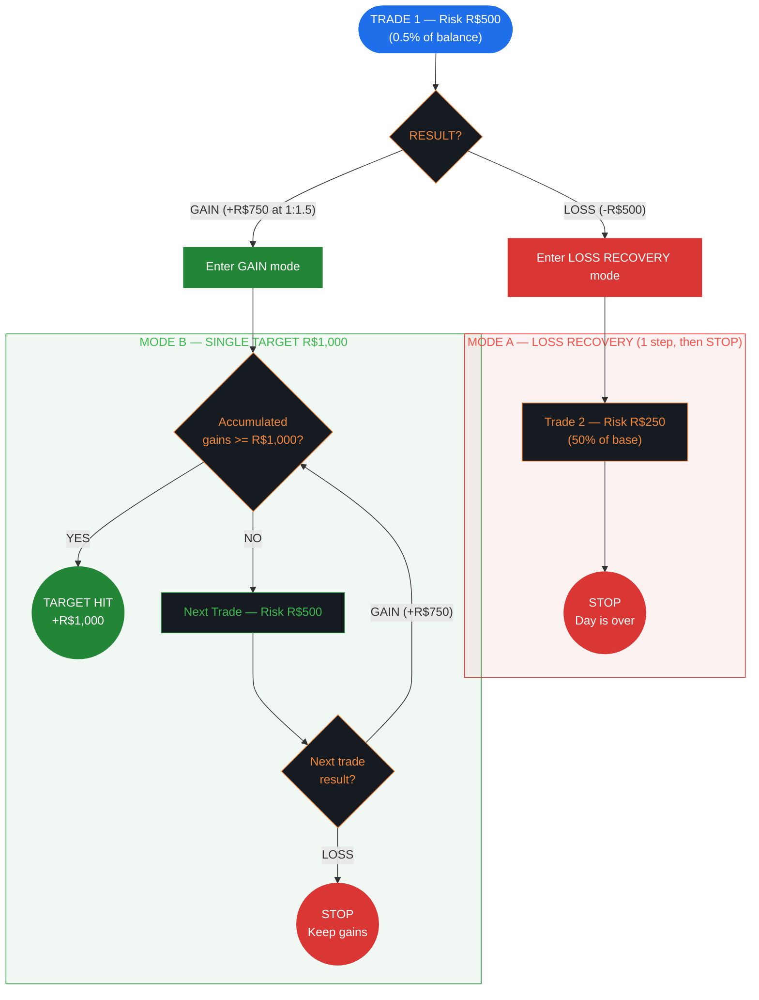
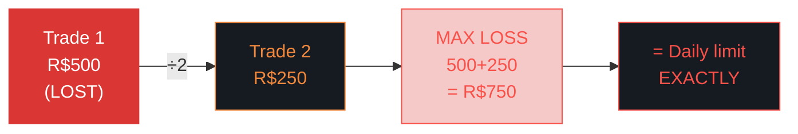
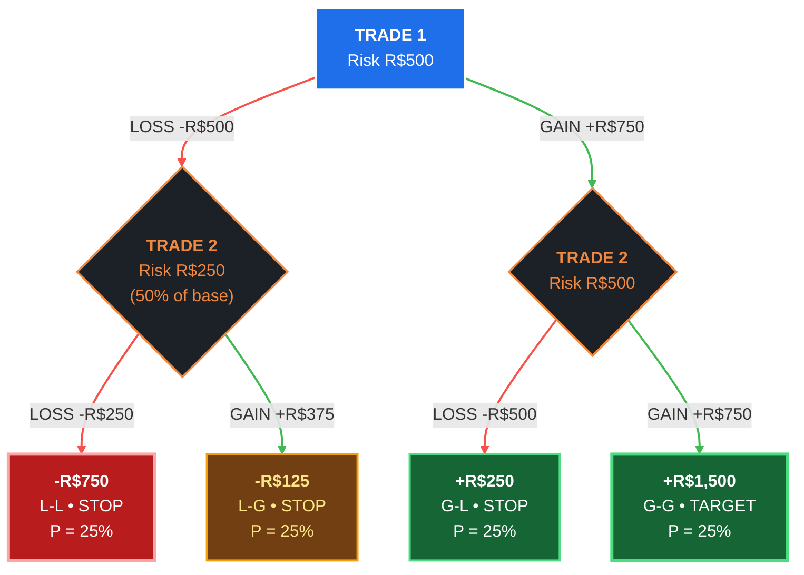
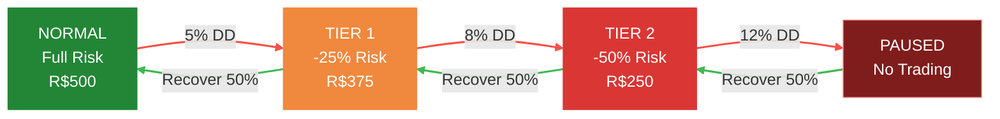

# Institutional (CTA/Quant Funds) — Risk Management Flowchart

> **Limits:** Per Trade R$500 (0.5% of balance) | Daily R$750 (1.5%) | Weekly R$2,000 (4%) | Monthly R$4,000 (8%)
>
> **Sizing:** 0.5% of current balance | **Gain Target:** R$1,000/day | **Author:** CTA/Quant Funds

---

## 1. Strategy Overview & Philosophy

**Institutional** risk management mirrors how professional **Commodity Trading Advisors (CTAs)** and **quantitative hedge funds** manage risk. The defining feature is a **3-tier drawdown control system** that progressively reduces exposure as losses accumulate — the same approach used by firms like AQR, Man Group, and Renaissance Technologies.

**Core principle:** Capital preservation above all. Small, consistent returns compound into large absolute gains. A 50% drawdown requires 100% gain to recover — so preventing deep drawdowns is mathematically more important than chasing large wins.

**When to use this strategy:**
- You prioritize capital preservation over aggressive growth
- You have a high win rate (60%+) with moderate R:R
- You want institutional-grade drawdown protection
- You're managing larger capital where consistency matters more than home runs

---

## 2. Default Parameters

### Risk Limits

| Scope     | Absolute (R$) | % of Initial Balance |
|-----------|--------------|---------------------|
| Per Trade | R$500        | 0.5%                |
| Daily     | R$750        | 1.5%                |
| Weekly    | R$2,000      | 4%                  |
| Monthly   | R$4,000      | 8%                  |

> **Note:** The tightest limits of all 5 templates. Daily limit is only R$750 — the loss recovery sequence fills it exactly.

### Sizing Mode

**Percent of Balance** — risk 0.5% of current balance per trade (most conservative of all templates).

```
Risk = Balance × 0.005
Contracts = Risk / (Stop points × Point value)
```

### Gain Target

**Single Target:** R$1,000/day — modest but realistic. At R:R 1:1.5, only 2 wins needed.

### Drawdown Control (3-Tier System)

| Tier | Drawdown % | Action            | Effect                    |
|------|-----------|-------------------|---------------------------|
| 1    | 5%        | Reduce risk       | -25% position size        |
| 2    | 8%        | Reduce risk       | -50% position size        |
| 3    | 12%       | **PAUSE**         | Stop all trading          |

Recovery threshold: 50% — must recover half the drawdown before restoring previous tier.

```
Example on R$100,000 account:
  -R$5,000  (5% DD)  → risk drops from R$500 to R$375
  -R$8,000  (8% DD)  → risk drops to R$250
  -R$12,000 (12% DD) → FULL PAUSE — no trading until recovery
  Recovery to -R$6,000 (50% of 12%) → resume at Tier 2 risk
```

### No Consecutive Loss Rules

The institutional model relies on the 3-tier drawdown system instead of counting consecutive red days. The drawdown tiers provide equivalent protection but respond to actual capital impact rather than day count.

---

## 3. Main Decision Flow



---

## 4. Loss Recovery — Size Reduction Sequence



**Rules:**
- Only **1 recovery trade** after the initial loss
- `stopAfterSequence: true` — after Trade 2, the day is **over**
- Maximum loss: R$500 + R$250 = **R$750** — this matches the daily limit exactly
- **Zero buffer:** hitting max loss = hitting daily limit. By design.

---

## 5. Complete Decision Tree — All Paths (R:R 1:1.5, WR 50%)

> This tree shows **every possible day outcome** from Trade 1 to termination. Left branches = LOSS (red), right branches = GAIN (green). Bottom nodes show the final day P&L, path pattern, and probability.



### All Paths — Complete Table

| #  | Path | T1      | T2       | **Day Result**  | Probability | Category            |
|----|------|---------|----------|----------------|-------------|---------------------|
| 1  | L-L  | -R$500  | -R$250   | **-R$750**     | 25%         | Max loss (= daily limit) |
| 2  | L-G  | -R$500  | +R$375   | **-R$125**     | 25%         | Near breakeven      |
| 3  | G-L  | +R$750  | -R$500   | **+R$250**     | 25%         | Small win           |
| 4  | G-G  | +R$750  | +R$750   | **+R$1,500**   | 25%         | TARGET HIT          |

> **Perfectly symmetric:** Each of the 4 paths has exactly 25% probability. The day always resolves in exactly 2 trades. This is the most predictable strategy structure of all templates.

### Expected Value — Full Day

```
E[day] = 0.25 × (-750) + 0.25 × (-125) + 0.25 × (250) + 0.25 × (1500)
       = -187.50 - 31.25 + 62.50 + 375.00
       = +R$218.75

Monthly (22 days): +R$4,812.50
```

---

## 6. Mode Details

### Loss Recovery (Paths 1-2)

After T1 LOSS, one recovery trade at 50% risk, then STOP. `stopAfterSequence: true` — the day is over regardless of T2's outcome.

- **L-L (25%):** Max loss -R$750 = daily limit exactly. Zero buffer by design.
- **L-G (25%):** Recovery partially offsets T1 loss. Still negative (-R$125).

**E[Loss Mode] = 0.50(-750) + 0.50(-125) = -R$437.50**

### Gain Mode — Single Target R$1,000 (Paths 3-4)

At R:R 1:1.5, each win adds R$750. Target = R$1,000, so only **2 wins** needed (R$1,500 >= R$1,000).

- **G-L (25%):** One win, then loss stops the day. Keep net +R$250.
- **G-G (25%):** Two wins = R$1,500 >= target. Day done with +R$1,500.

**E[Gain Mode] = 0.50(250) + 0.50(1500) = +R$875.00**

> **Elegant design:** Only 2 wins needed means gain mode resolves in a single trade after T1. You're either up R$250 or R$1,500 — no extended multi-trade sequences.

---

## 7. Unique Features

### 3-Tier Drawdown System

This is the defining feature. Unlike other templates that use a single drawdown threshold, the institutional model has **progressive degradation**:



**Why 3 tiers?**

Institutional funds discovered that single-threshold systems create a cliff: you're either at full risk or shut down. The 3-tier approach provides:
1. **Early warning** (5%) — slight reduction, still trading
2. **Serious caution** (8%) — significant reduction, survival mode
3. **Circuit breaker** (12%) — full stop, reassess everything

### Tightest Limits of All Templates

| Metric          | Institutional | Fixed Fractional | R-Multiples |
|-----------------|--------------|-----------------|-------------|
| Daily loss      | 1.5%         | 2%              | 3R          |
| Weekly loss     | 4%           | 5%              | 5R          |
| Monthly loss    | 8%           | 10%             | 10R         |
| Sizing          | 0.5%         | 0.75%           | Fixed       |

The institutional template sacrifices upside for downside protection. This is the **slowest growth** but **most durable** model.

---

## 8. Simulation — 3 WR/RR Profiles

### Profile A: Sweet Spot — WR 65%, R:R 1:1

**Per-trade:** Win = R$500 | Loss = R$500 | PF = 1.86

#### Loss Recovery Paths

| Path | T1     | T2       | **Result**  | Prob   |
|------|--------|----------|------------|--------|
| L-L  | -R$500 | -R$250   | **-R$750** | 35.0%  |
| L-G  | -R$500 | +R$250   | **-R$250** | 65.0%  |

**E[Loss Mode] = 0.35(-750) + 0.65(-250) = -R$425.00**

#### Gain Mode Paths (need 2 wins for R$1,000)

| Path       | Result       | Probability |
|------------|-------------|-------------|
| 1W, 1L     | **+R$0**    | 35.00%      |
| 2W (target)| **+R$1,000**| 42.25%      |

**E[Gain Mode] = 0.35(0) + 0.4225(1000) = +R$422.50**

#### Daily Expected Value

```
E[day] = 0.65 × R$422.50 + 0.35 × (-R$425.00) = +R$125.88
Monthly (22 days): +R$2,769
```

**Modest but steady.** The institutional model won't make you rich fast, but it's extremely hard to blow up.

---

### Profile B: Borderline — WR 55%, R:R 1:0.8

**Per-trade:** Win = R$400 | Loss = R$500 | PF = 0.98

#### Loss Recovery Paths

| Path | T1     | T2       | **Result**  | Prob   |
|------|--------|----------|------------|--------|
| L-L  | -R$500 | -R$250   | **-R$750** | 45.0%  |
| L-G  | -R$500 | +R$200   | **-R$300** | 55.0%  |

**E[Loss Mode] = 0.45(-750) + 0.55(-300) = -R$502.50**

#### Gain Mode Paths (need 3 wins for R$1,000)

| Path       | Result       | Probability |
|------------|-------------|-------------|
| 1W, 1L     | **-R$100**  | 45.00%      |
| 2W, 1L     | **+R$300**  | 24.75%      |
| 3W (target)| **+R$1,200**| 16.64%      |

**E[Gain Mode] = 0.45(-100) + 0.2475(300) + 0.1664(1200) = +R$128.93**

#### Daily Expected Value

```
E[day] = 0.55 × R$128.93 + 0.45 × (-R$502.50) = -R$155.22
Monthly (22 days): -R$3,415
```

**Would hit the 8% monthly limit in ~18 days.** The 3-tier drawdown system would intervene well before that — Tier 1 at ~5% drawdown (~11 loss-days).

---

### Profile C: Bad — WR 45%, R:R 1:0.5

**Per-trade:** Win = R$250 | Loss = R$500 | PF = 0.41

#### Loss Recovery Paths

| Path | T1     | T2       | **Result**  | Prob   |
|------|--------|----------|------------|--------|
| L-L  | -R$500 | -R$250   | **-R$750** | 55.0%  |
| L-G  | -R$500 | +R$125   | **-R$375** | 45.0%  |

**E[Loss Mode] = 0.55(-750) + 0.45(-375) = -R$581.25**

#### Gain Mode Paths (need 4 wins for R$1,000)

| Path       | Result       | Probability |
|------------|-------------|-------------|
| 1W, 1L     | **-R$250**  | 55.00%      |
| 2W, 1L     | **+R$0**    | 24.75%      |
| 3W, 1L     | **+R$250**  | 11.14%      |
| 4W (target)| **+R$1,000**| 4.10%       |

**E[Gain Mode] = 0.55(-250) + 0.2475(0) + 0.1114(250) + 0.041(1000) = -R$68.65**

#### Daily Expected Value

```
E[day] = 0.45 × (-R$68.65) + 0.55 × (-R$581.25) = -R$350.58
Monthly (22 days): -R$7,713
```

**The 3-tier system saves you here:** Tier 1 triggers after ~7 loss-days, Tier 3 (pause) after ~16 days. The system would shut you down before monthly limit is hit.

---

## 9. Quick Reference Card

```
╔══════════════════════════════════════════════════════════════╗
║  INSTITUTIONAL (CTA/Quant) — QUICK REFERENCE                 ║
╠══════════════════════════════════════════════════════════════╣
║                                                              ║
║  SIZING: 0.5% of current balance (most conservative)         ║
║  BASE RISK: R$500 (at R$100,000 balance)                     ║
║                                                              ║
║  TRADE 1 LOST?                  TRADE 1 WON?                 ║
║  ──────────────                 ──────────────                ║
║  1. Trade 2 at R$250 (50%)     1. Gains >= R$1,000? → STOP   ║
║  2. STOP. Day over.            2. Next trade at R$500         ║
║                                3. Lost? → STOP (keep gains)   ║
║  Max loss: R$750               4. Won? → Back to step 1       ║
║  = daily limit exactly                                       ║
║                                                              ║
║  DAILY LIMITS           3-TIER DRAWDOWN                      ║
║  ─────────────          ───────────────                      ║
║  Loss:  R$750 (1.5%)    5% DD → reduce 25%                  ║
║  Gain:  R$1,000          8% DD → reduce 50%                  ║
║  Weekly: R$2,000 (4%)   12% DD → PAUSE ALL                  ║
║  Monthly: R$4,000 (8%)  Recovery: 50% threshold              ║
║                                                              ║
║  NO consecutive loss rules — drawdown tiers handle it        ║
║                                                              ║
╚══════════════════════════════════════════════════════════════╝
```
