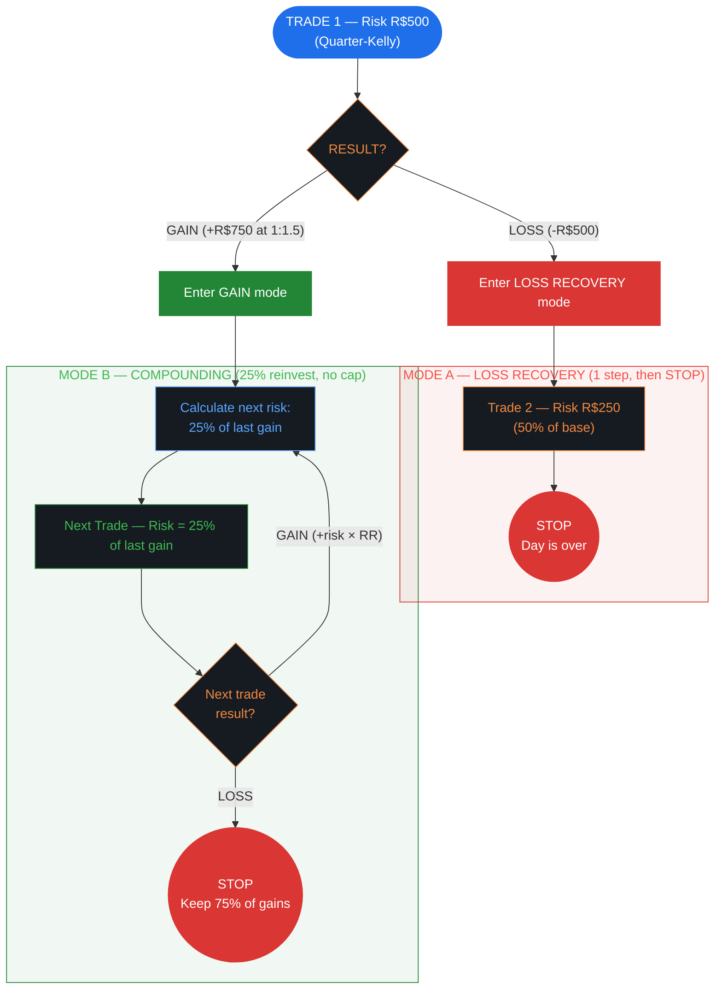
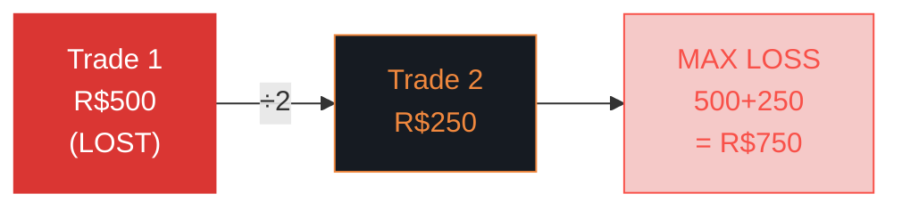
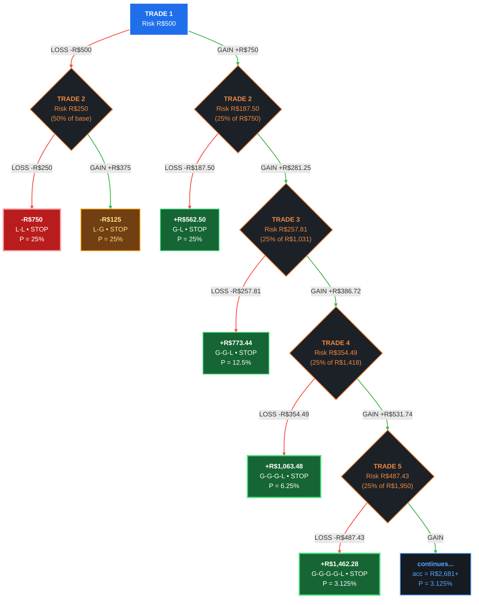

# Kelly Fractional (Kelly/Shannon) — Risk Management Flowchart

> **Limits:** Per Trade R$500 | Daily R$1,500 (3%) | Weekly R$3,500 (7%) | Monthly R$7,500 (15%)
>
> **Sizing:** Quarter-Kelly (Kelly% ÷ 4) | **Gain Mode:** Compounding (25% reinvest) | **Author:** John L. Kelly Jr. / Claude Shannon

---

## 1. Strategy Overview & Philosophy

**Kelly Fractional** applies the **Kelly Criterion** — a formula from information theory that calculates the mathematically optimal bet size to maximize long-term geometric growth. Developed by **John L. Kelly Jr.** at Bell Labs in 1956 and later applied to gambling and investing by **Claude Shannon** and **Edward Thorp**.

**Core principle:** There exists a mathematically provable optimal fraction of your capital to risk on each trade. Bet more and you over-leverage (eventual ruin). Bet less and you leave growth on the table. The Kelly formula finds the exact sweet spot.

**The safety divisor:** Full Kelly is notoriously volatile — drawdowns of 50%+ are expected. This template uses **Quarter-Kelly** (Kelly ÷ 4), which sacrifices ~25% of the growth rate but reduces drawdowns by ~75%. This is the standard approach used by professional Kelly practitioners.

**When to use this strategy:**
- You have reliable, stable estimates of your WR and R:R
- You want mathematically optimal growth over the long term
- You understand that Kelly sizing fluctuates with your edge
- You're comfortable with a formula-driven approach

---

## 2. Default Parameters

### Risk Limits

| Scope     | Absolute (R$) | % of Initial Balance |
|-----------|--------------|---------------------|
| Per Trade | R$500        | varies (Kelly-based) |
| Daily     | R$1,500      | 3%                  |
| Weekly    | R$3,500      | 7%                  |
| Monthly   | R$7,500      | 15%                 |

> **Note:** Most generous limits of all templates. The Kelly formula self-regulates risk, so wider limits allow it to operate naturally.

### Sizing Mode

**Kelly Fractional** — risk = (Kelly% ÷ 4) of current balance.

```
Kelly% = (WR × (1 + RR) - 1) / RR
Quarter-Kelly = Kelly% / 4
Risk = Balance × Quarter-Kelly
```

#### Kelly% at Common WR/RR Combinations

| WR \ RR | 1:1   | 1:1.5 | 1:2   | 1:3   |
|---------|-------|-------|-------|-------|
| 40%     | -20%  | -7%   | 0%    | 7%    |
| 50%     | 0%    | 8%    | 13%   | 17%   |
| 55%     | 10%   | 17%   | 18%   | 18%   |
| 60%     | 20%   | 23%   | 20%   | 20%   |
| 65%     | 30%   | 28%   | 23%   | 22%   |

*Negative Kelly% = no edge, don't trade. Quarter-Kelly divides these values by 4.*

#### Example: WR 60%, R:R 1:1.5

```
Kelly% = (0.60 × 2.5 - 1) / 1.5 = 0.50 / 1.5 = 33.3%
Quarter-Kelly = 33.3% / 4 = 8.3%
Risk on R$50,000 balance = R$4,150
```

> **Note:** At high edges, even Quarter-Kelly can produce large risk amounts. The R$500 base and daily limits act as hard caps.

### Gain Mode

**Compounding:** Reinvest 25% of gains, stop on first loss, no daily target cap.

### Drawdown Control (2-Tier)

| Tier | Drawdown % | Action            |
|------|-----------|-------------------|
| 1    | 10%       | Reduce risk by 50%|
| 2    | 15%       | **PAUSE**         |

Recovery threshold: 50%.

---

## 3. Main Decision Flow



---

## 4. Loss Recovery — Size Reduction Sequence



**Rules:**
- Only **1 recovery trade** after the initial loss
- `stopAfterSequence: true` — after Trade 2, the day is **over**
- Maximum loss: R$500 + R$250 = **R$750** (50% of daily R$1,500 limit)
- Leaves R$750 buffer before hitting daily limit — useful since Kelly sizing can vary

---

## 5. Complete Decision Tree — All Paths (R:R 1:1.5, WR 50%)

> This tree shows **every possible path** from Trade 1 to termination. The gain side uses **compounding** (25% of accumulated gains as risk). Since there's no daily target cap, the gain side is theoretically infinite — shown here truncated at 4 gain trades. Gains grow geometrically at 1.375× per win.



### All Paths — Complete Table

| #  | Path       | Accumulated | Risk (25%) | **Day Result** | Probability | Category      |
|----|------------|------------|-----------|---------------|-------------|---------------|
| 1  | L-L        | —          | —         | **-R$750**    | 25.00%      | Max loss      |
| 2  | L-G        | —          | —         | **-R$125**    | 25.00%      | Near breakeven |
| 3  | G-L        | R$750      | R$187.50  | **+R$562.50** | 25.00%      | Keep 75%      |
| 4  | G-G-L      | R$1,031.25 | R$257.81  | **+R$773.44** | 12.50%      | Keep 75%      |
| 5  | G-G-G-L    | R$1,417.97 | R$354.49  | **+R$1,063.48** | 6.25%    | Keep 75%      |
| 6  | G-G-G-G-L  | R$1,949.71 | R$487.43  | **+R$1,462.28** | 3.125%   | Keep 75%      |
| 7  | G-G-G-G-G+ | R$2,680.85+| —         | **continues** | 3.125%      | Geometric growth |

> **Key insight:** Compounding at 25% of accumulated with R:R 1:1.5 produces a win multiplier of **1.375× per consecutive win**. This is geometric growth — not convergent. Every gain-mode outcome is positive (minimum +R$562.50). The "keep 75%" rule means you always walk away with at least 75% of your peak accumulated gains.

### Expected Value — Full Day

The gain side forms an infinite geometric series with ratio 0.6875 (convergent):

```
E[gain side] = 0.75 × R$750 × 0.25 × 1/(1 - 0.6875)
             = R$562.50 × 0.25 × 3.2
             = +R$450.00

E[loss side] = 0.25(-750) + 0.25(-125) = -R$218.75

E[day] = -R$218.75 + R$450.00 = +R$231.25
Monthly (22 days): +R$5,088
```

---

## 6. Mode Details

### Loss Recovery (Paths 1-2)

After T1 LOSS, one recovery trade at 50% risk, then STOP. `stopAfterSequence: true`.

- **L-L (25%):** Max loss -R$750. Leaves R$750 buffer below daily R$1,500 limit.
- **L-G (25%):** Near breakeven at -R$125.

**E[Loss Mode] = 0.50(-750) + 0.50(-125) = -R$437.50**

### Gain Mode — Compounding 25% of Accumulated (Paths 3-7)

After T1 WIN, each subsequent trade risks **25% of accumulated gains**. On a loss, you keep 75% of accumulated. `stopOnFirstLoss: true`. No daily target cap.

**Compounding Walkthrough at R:R 1:1.5:**

| Step   | Accumulated | Risk (25% of acc) | If WIN (+risk×1.5) | New Accumulated | If LOSS (keep 75%) |
|--------|------------|-------------------|-------------------|----------------|-------------------|
| T1 WIN | R$750      | —                 | —                 | R$750          | —                 |
| T2     | R$750      | R$187.50          | +R$281.25         | R$1,031.25     | **+R$562.50**     |
| T3     | R$1,031.25 | R$257.81          | +R$386.72         | R$1,417.97     | **+R$773.44**     |
| T4     | R$1,417.97 | R$354.49          | +R$531.74         | R$1,949.71     | **+R$1,063.48**   |
| T5     | R$1,949.71 | R$487.43          | +R$731.14         | R$2,680.85     | **+R$1,462.28**   |

**E[Gain Mode] = +R$450.00 / 0.50 = +R$900.00** (conditional on T1=GAIN)

> **Geometric growth, not convergent.** Unlike what fixed-percentage-of-last-gain would produce, 25% of accumulated creates 1.375× compounding per win. After 5 consecutive wins, accumulated = R$2,681. After 10 wins, accumulated = R$11,461. The "keep 75%" safety ensures every outcome is positive.

---

## 7. Unique Features

### The Kelly Formula

The Kelly Criterion is one of the few mathematically proven results in position sizing:

```
f* = (p × b - q) / b

where:
  f* = optimal fraction of capital to risk
  p  = probability of winning (WR)
  q  = probability of losing (1 - WR)
  b  = net odds received (R:R ratio)
```

**Rewritten for traders:**

```
Kelly% = (WR × (1 + RR) - 1) / RR
```

**Why divide by 4?**

Full Kelly maximizes the geometric growth rate but produces drawdowns that are psychologically and practically unbearable:

| Kelly Fraction | Growth Rate | Max Expected Drawdown |
|---------------|-------------|----------------------|
| Full Kelly    | 100%        | ~50-80%              |
| Half Kelly    | 75%         | ~25-40%              |
| Quarter Kelly | 50%         | ~12-20%              |
| Eighth Kelly  | 25%         | ~6-10%               |

Quarter-Kelly gives 50% of the maximum growth rate with only ~15% expected max drawdown. This is the standard professional recommendation.

### Self-Adjusting Risk

Unlike fixed or percent-of-balance sizing, Kelly automatically adjusts to your edge:

```
Edge improves (WR 55% → 65%):
  Kelly% = 28% → Quarter = 7% → higher risk per trade

Edge deteriorates (WR 55% → 45%):
  Kelly% = 8% → Quarter = 2% → lower risk per trade

Edge disappears (WR 40%, RR 1:1):
  Kelly% = -20% → Quarter = -5% → DON'T TRADE
```

When Kelly goes negative, the formula is explicitly telling you: **there is no edge. Stop trading.**

### 2-Tier Drawdown with Kelly

The drawdown tiers interact with Kelly sizing in a unique way:

```
Normal:  Quarter-Kelly = 8.3% → R$4,150 risk (capped at R$500)
Tier 1 (10% DD): Quarter-Kelly × 50% = 4.2% → R$2,100 risk (capped at R$500)
Tier 2 (15% DD): PAUSE — Kelly likely near zero anyway
```

At typical Quarter-Kelly values, the R$500 base risk cap is usually the binding constraint. The drawdown tiers become relevant when Kelly would suggest higher risk.

---

## 8. Simulation — 3 WR/RR Profiles

### Profile A: Sweet Spot — WR 55%, R:R 1:2

**Per-trade:** Win = R$1,000 | Loss = R$500 | PF = 2.44
**Kelly% = (0.55 × 3 - 1) / 2 = 32.5% → Quarter = 8.1%**

#### Loss Recovery Paths

| Path | T1     | T2       | **Result**  | Prob   |
|------|--------|----------|------------|--------|
| L-L  | -R$500 | -R$250   | **-R$750** | 45.0%  |
| L-G  | -R$500 | +R$500   | **R$0**    | 55.0%  |

**E[Loss Mode] = 0.45(-750) + 0.55(0) = -R$337.50**

#### Gain Mode Paths (25% reinvest, compounding)

| Step | Last Gain | Risk (25%) | If WIN     | Accumulated | If LOSS (keep 75%) |
|------|----------|-----------|-----------|------------|-------------------|
| T1 WIN | —     | —         | +R$1,000  | R$1,000    | —                 |
| T2   | R$1,000  | R$250     | +R$500    | R$1,500    | **+R$750**        |
| T3   | R$500    | R$125     | +R$250    | R$1,750    | **+R$1,125**      |
| T4   | R$250    | R$62.50   | +R$125    | R$1,875    | **+R$1,562.50**   |

| Path       | Result             | Probability |
|------------|-------------------|-------------|
| 1W, 1L     | **+R$750**        | 45.00%      |
| 2W, 1L     | **+R$1,125**      | 24.75%      |
| 3W, 1L     | **+R$1,562.50**   | 13.61%      |
| 4W+        | **+R$1,750+**     | 16.64%      |

**E[Gain Mode] = 0.45(750) + 0.2475(1125) + 0.1361(1562.50) + 0.1664(1812.50) = +R$1,131.10**

#### Daily Expected Value

```
E[day] = 0.55 × R$1,131.10 + 0.45 × (-R$337.50) = +R$470.23
Monthly (22 days): +R$10,345
```

---

### Profile B: Borderline — WR 50%, R:R 1:1.5

**Per-trade:** Win = R$750 | Loss = R$500 | PF = 1.50
**Kelly% = (0.50 × 2.5 - 1) / 1.5 = 16.7% → Quarter = 4.2%**

#### Loss Recovery Paths

| Path | T1     | T2       | **Result**  | Prob   |
|------|--------|----------|------------|--------|
| L-L  | -R$500 | -R$250   | **-R$750** | 50.0%  |
| L-G  | -R$500 | +R$375   | **-R$125** | 50.0%  |

**E[Loss Mode] = -R$437.50**

#### Gain Mode Paths (25% reinvest)

| Path       | Result             | Probability |
|------------|-------------------|-------------|
| 1W, 1L     | **+R$562.50**     | 50.00%      |
| 2W, 1L     | **+R$773.44**     | 25.00%      |
| 3W, 1L     | **+R$1,063.48**   | 12.50%      |
| 4W+        | **+R$1,149+**     | 12.50%      |

**E[Gain Mode] = +R$752.98**

#### Daily Expected Value

```
E[day] = 0.50 × R$752.98 + 0.50 × (-R$437.50) = +R$157.74
Monthly (22 days): +R$3,470
```

**Positive and stable.** Quarter-Kelly at this edge would suggest 4.2% risk — the R$500 cap is doing the work.

---

### Profile C: Bad — WR 40%, R:R 1:1

**Per-trade:** Win = R$500 | Loss = R$500 | PF = 0.67
**Kelly% = (0.40 × 2 - 1) / 1 = -20% → Quarter = -5% → NO EDGE**

> **Kelly says: DON'T TRADE.** The formula produces a negative value, meaning there is no bet size that produces positive long-term growth. The simulation below shows what happens if you ignore this warning.

#### Loss Recovery Paths

| Path | T1     | T2       | **Result**  | Prob   |
|------|--------|----------|------------|--------|
| L-L  | -R$500 | -R$250   | **-R$750** | 60.0%  |
| L-G  | -R$500 | +R$250   | **-R$250** | 40.0%  |

**E[Loss Mode] = 0.60(-750) + 0.40(-250) = -R$550.00**

#### Gain Mode Paths (25% reinvest)

| Step | Last Gain | Risk (25%) | If WIN    | Accumulated | If LOSS (keep 75%) |
|------|----------|-----------|----------|------------|-------------------|
| T1 WIN | —     | —         | +R$500   | R$500      | —                 |
| T2   | R$500    | R$125     | +R$125   | R$625      | **+R$375**        |
| T3   | R$125    | R$31.25   | +R$31.25 | R$656.25   | **+R$500**        |

| Path       | Result             | Probability |
|------------|-------------------|-------------|
| 1W, 1L     | **+R$375**        | 60.00%      |
| 2W, 1L     | **+R$500**        | 24.00%      |
| 3W+        | **+R$550+**       | 16.00%      |

**E[Gain Mode] = 0.60(375) + 0.24(500) + 0.16(556.25) = +R$434.00**

#### Daily Expected Value

```
E[day] = 0.40 × R$434.00 + 0.60 × (-R$550.00) = -R$156.40
Monthly (22 days): -R$3,441
```

**Kelly warned you.** Negative Kelly% = negative expectancy. The 15% drawdown pause would trigger in ~7 weeks.

---

## 9. Quick Reference Card

```
╔══════════════════════════════════════════════════════════════╗
║  KELLY FRACTIONAL (Kelly/Shannon) — QUICK REFERENCE          ║
╠══════════════════════════════════════════════════════════════╣
║                                                              ║
║  SIZING: Quarter-Kelly = Kelly% ÷ 4                          ║
║  FORMULA: Kelly% = (WR × (1+RR) - 1) / RR                  ║
║  BASE RISK: R$500 (hard cap)                                 ║
║                                                              ║
║  TRADE 1 LOST?                  TRADE 1 WON?                 ║
║  ──────────────                 ──────────────                ║
║  1. Trade 2 at R$250 (50%)     1. Risk = 25% of last gain    ║
║  2. STOP. Day over.            2. Lost? → STOP (keep 75%)    ║
║                                3. Won? → recalculate, repeat  ║
║  Max loss: R$750               No daily cap — converges       ║
║                                                              ║
║  DAILY LIMITS           DRAWDOWN CONTROL                     ║
║  ─────────────          ────────────────                     ║
║  Loss:  R$1,500 (3%)   10% DD → reduce 50%                  ║
║  Weekly: R$3,500 (7%)   15% DD → PAUSE ALL                  ║
║  Monthly: R$7,500 (15%) Recovery: 50% threshold              ║
║                                                              ║
║  KEY RULE: If Kelly% < 0, DON'T TRADE                        ║
║                                                              ║
╚══════════════════════════════════════════════════════════════╝
```
