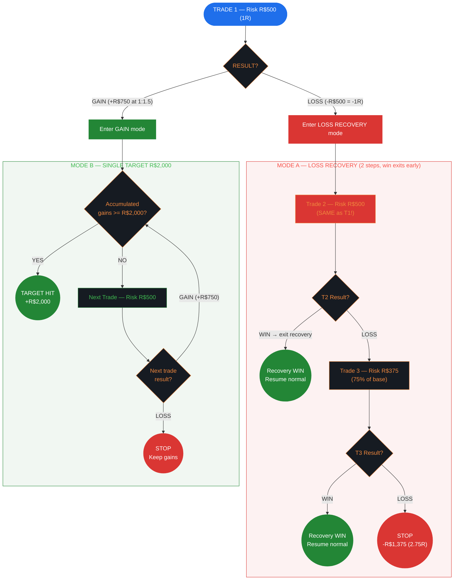
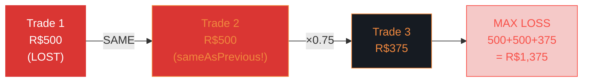
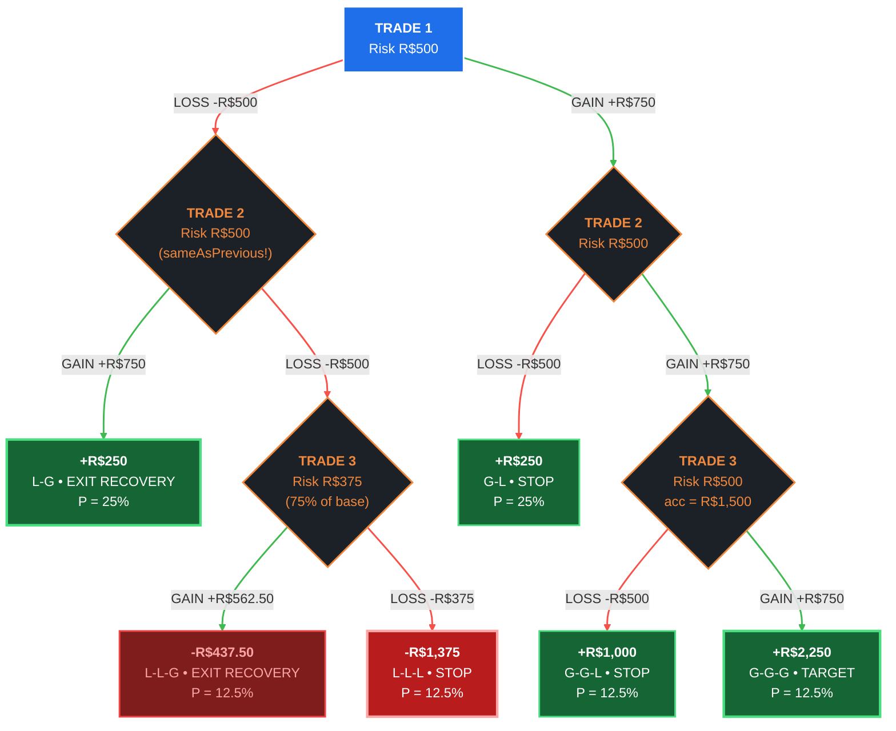

# R-Multiples (Van Tharp / Larry Williams) — Risk Management Flowchart

> **Limits:** Per Trade R$500 | Daily 3R (R$1,500) | Weekly 5R (R$2,500) | Monthly 10R (R$5,000)
>
> **Sizing:** Fixed (always R$500) | **Gain Target:** R$2,000/day | **Author:** Van Tharp / Larry Williams

---

## 1. Strategy Overview & Philosophy

**R-Multiples** is a pure risk-unit framework popularized by **Van Tharp** in *Trade Your Way to Financial Freedom* and refined by **Larry Williams** (1987 World Cup Trading Championship winner, turning $10,000 into $1.1 million in one year). Every aspect of the system is measured in "R" — one unit of base risk.

**Core principle:** Forget dollar amounts. Think in R. A 2R win means you gained twice your risk. A -1R loss means you lost one risk unit. This framework normalizes all trades, making performance comparison across different position sizes, instruments, and time periods trivially easy.

**Key distinction:** This is the only template where T2 uses `sameAsPrevious` — the recovery trade risks the **same amount as T1** (full R$500). This is the most aggressive recovery approach, based on Larry Williams' philosophy that "the best trade often follows a loss."

**When to use this strategy:**
- You think in R-multiples naturally
- You want fixed, predictable risk per trade (no formula adjustments)
- You believe in aggressive recovery after a loss
- You target moderate-to-high R:R trades (1:1.5 to 1:3)

---

## 2. Default Parameters

### Risk Limits (R-Multiple Mode)

| Scope     | R-Multiples | Absolute (R$) |
|-----------|------------|---------------|
| Per Trade | 1R         | R$500         |
| Daily     | 3R         | R$1,500       |
| Weekly    | 5R         | R$2,500       |
| Monthly   | 10R        | R$5,000       |

### Sizing Mode

**Fixed** — always risk R$500 per trade regardless of account balance.

```
Risk = R$500 (constant)
Contracts = 500 / (Stop points × Point value)
```

No formulas, no percentage calculations, no scaling. The simplest sizing mode of all templates.

### Gain Target

**Single Target:** R$2,000/day — needs 3 wins at R:R 1:1.5 (each win = R$750, so 3 × R$750 = R$2,250 > R$2,000).

### No Drawdown Tiers or Consecutive Loss Rules

This template has **neither drawdown tiers nor consecutive loss rules**. Risk control comes entirely from:
1. The 3R daily limit (hard stop at 3 losses)
2. The 5R weekly limit
3. The 10R monthly limit
4. The aggressive T2 recovery providing quick breakeven opportunities

---

## 3. Main Decision Flow



---

## 4. Loss Recovery — Size Reduction Sequence



**Rules:**
- **2 recovery trades**, but T2 uses `sameAsPrevious` — **FULL R$500 risk** (most aggressive)
- T3 drops to 75% of base (R$375)
- `stopAfterSequence: false` — a **win at any point exits recovery**
- Maximum loss (all 3 lose): R$500 + R$500 + R$375 = **R$1,375** (= 2.75R, within 3R daily limit)

> **Why same risk on T2?** Larry Williams observed that after a loss, many traders reduce size out of fear — but statistically, the next trade's outcome is independent. By keeping T2 at full size, a T2 win not only exits recovery but produces a net gain: -R$500 + R$750 = +R$250. This is the **only template where loss mode can produce a positive day on just one recovery trade.**

---

## 5. Complete Decision Tree — All Paths (R:R 1:1.5, WR 50%)

> This tree shows **every possible path** from Trade 1 to termination. Left branches = LOSS (red), right branches = GAIN (green). Recovery exits (L-G, L-L-G) allow the trader to resume a new trading cycle.



### All Paths — Complete Table

| #  | Path   | T1      | T2       | T3         | **Day Result**   | Probability | Category               |
|----|--------|---------|----------|------------|-----------------|-------------|------------------------|
| 1  | L-G    | -R$500  | +R$750   | —          | **+R$250**      | 25.0%       | Recovery win (unique!)  |
| 2  | L-L-G  | -R$500  | -R$500   | +R$562.50  | **-R$437.50**   | 12.5%       | Late recovery          |
| 3  | L-L-L  | -R$500  | -R$500   | -R$375     | **-R$1,375**    | 12.5%       | Max loss (2.75R)       |
| 4  | G-L    | +R$750  | -R$500   | —          | **+R$250**      | 25.0%       | Small win              |
| 5  | G-G-L  | +R$750  | +R$750   | -R$500     | **+R$1,000**    | 12.5%       | Good win               |
| 6  | G-G-G  | +R$750  | +R$750   | +R$750     | **+R$2,250**    | 12.5%       | TARGET HIT             |

> **6 possible outcomes.** Paths 1 and 4 produce the same result (+R$250) through completely different routes — one from loss recovery, one from gain mode. The `sameAsPrevious` T2 makes path 1 positive, which is unique among all templates. Recovery exits (paths 1-2) may continue with a new trading cycle.

### Expected Value — Full Day

```
E[day] = 0.25(250) + 0.125(-437.50) + 0.125(-1375) + 0.25(250) + 0.125(1000) + 0.125(2250)
       = 62.50 - 54.69 - 171.88 + 62.50 + 125.00 + 281.25
       = +R$304.69

Monthly (22 days): +R$6,703
```

---

## 6. Mode Details

### Loss Recovery — Paths 1-3

After T1 LOSS, 2-step recovery with `sameAsPrevious` T2 (FULL R$500), then T3 at 75% (R$375). `stopAfterSequence: false` — a win at any point exits recovery and resumes normal trading.

- **L-G (25%):** T2 wins at full risk → immediate net profit +R$250. **Only template where loss mode produces a gain.**
- **L-L-G (12.5%):** Two losses then a win. Net -R$437.50. Exits recovery for a new cycle.
- **L-L-L (12.5%):** Three consecutive losses. Worst case -R$1,375 (2.75R). STOP.

**E[Loss Mode] = 0.50(250) + 0.25(-437.50) + 0.25(-1375) = -R$328.13** ← Best of ALL templates

### Gain Mode — Single Target R$2,000 (Paths 4-6)

Each win adds R$750 (at R:R 1:1.5). Target = R$2,000, needs **3 wins** (3 × R$750 = R$2,250 >= R$2,000). Risk stays flat at R$500. A loss stops the day.

| Win # | Accumulated | Still Needed | P(reaching) at 50% WR |
|-------|------------|-------------|----------------------|
| 1     | R$750      | R$1,250     | 50.0%                |
| 2     | R$1,500    | R$500       | 25.0%                |
| 3     | R$2,250    | R$0 (HIT!)  | 12.5%                |

**E[Gain Mode] = 0.50(250) + 0.25(1000) + 0.125(2250) = +R$656.25**

### Comparison: T2 Risk Strategies

| Template        | T2 Risk  | L-G Result | E[Loss Mode] |
|-----------------|----------|-----------|-------------|
| **R-Multiples** | R$500 (same) | **+R$250** | **-R$328.13** |
| Fixed Ratio     | R$375 (75%)  | +R$62.50   | -R$375.00     |
| Fixed Fractional| R$250 (50%)  | -R$125     | -R$437.50     |
| Institutional   | R$250 (50%)  | -R$125     | -R$437.50     |

---

## 7. Unique Features

### The `sameAsPrevious` Recovery

This is R-Multiples' signature mechanic. Instead of reducing T2 risk, it keeps T2 at the same level as T1:

```
Standard approach:   T1 R$500 (LOSS) → T2 R$250 (50%)  → need +R$250 gain to break even
R-Multiples approach: T1 R$500 (LOSS) → T2 R$500 (SAME) → T2 win = immediate profit (+R$250)
```

**The math behind the aggression:**

At WR 50% and R:R 1:1.5:
- **Conservative T2 (R$250):** 50% chance of -R$125 net, 50% chance of -R$750 net
- **Aggressive T2 (R$500):** 50% chance of **+R$250 net**, 50% chance of continuing to T3

The aggressive approach turns loss mode into a **coin flip between profit and deeper recovery**. If you trust your edge, this is mathematically superior.

### Fixed Sizing — The Simplest Model

No formulas. No percentages. No scaling.

```
Trade 1: R$500
Trade 2: R$500
Trade 3: R$500
...
Trade 1000: R$500
```

**Advantages:**
- Zero cognitive load on position sizing
- Consistent risk makes R-multiple tracking trivial
- No need to recalculate after balance changes
- Easy to journal and analyze: every trade is 1R

**Disadvantage:**
- No geometric growth — as your account grows, R$500 becomes a smaller %. You must manually adjust base risk periodically.

### R-Multiple Tracking

With fixed sizing, your daily P&L is directly expressed in R:

| Day Result | R-Multiple | Meaning |
|-----------|-----------|---------|
| +R$2,250  | +4.5R     | Hit target (3 wins at 1:1.5) |
| +R$250    | +0.5R     | 1 win, 1 loss in loss or gain mode |
| -R$750    | -1.5R     | Loss mode: L-L (2 losses, stopped) |
| -R$1,375  | -2.75R    | Loss mode: L-L-L (worst case) |

This makes journaling and performance analysis natural — everything is normalized to R.

---

## 8. Simulation — 3 WR/RR Profiles

### Profile A: Sweet Spot — WR 50%, R:R 1:2

**Per-trade:** Win = R$1,000 | Loss = R$500 | PF = 2.00

#### Loss Recovery Paths (3-leaf tree)

| Path  | T1      | T2         | T3         | **Result**     | Prob   |
|-------|---------|------------|------------|---------------|--------|
| L-G   | -R$500  | +R$1,000   | —          | **+R$500**    | 50.0%  |
| L-L-G | -R$500  | -R$500     | +R$750     | **-R$250**    | 25.0%  |
| L-L-L | -R$500  | -R$500     | -R$375     | **-R$1,375**  | 25.0%  |

**E[Loss Mode] = 0.50(500) + 0.25(-250) + 0.25(-1375) = 250 - 62.50 - 343.75 = -R$156.25**

#### Gain Mode Paths (need 2 wins for R$2,000)

| Path       | Result       | Probability |
|------------|-------------|-------------|
| 1W, 1L     | **+R$500**  | 50.00%      |
| 2W (target)| **+R$2,000**| 25.00%      |

**E[Gain Mode] = 0.50(500) + 0.25(2000) = +R$750.00**

#### Daily Expected Value

```
E[day] = 0.50 × R$750.00 + 0.50 × (-R$156.25) = +R$296.88
Monthly (22 days): +R$6,531
```

---

### Profile B: Borderline — WR 40%, R:R 1:1.5

**Per-trade:** Win = R$750 | Loss = R$500 | PF = 1.00

#### Loss Recovery Paths

| Path  | T1      | T2         | T3         | **Result**      | Prob   |
|-------|---------|------------|------------|----------------|--------|
| L-G   | -R$500  | +R$750     | —          | **+R$250**     | 40.0%  |
| L-L-G | -R$500  | -R$500     | +R$562.50  | **-R$437.50**  | 24.0%  |
| L-L-L | -R$500  | -R$500     | -R$375     | **-R$1,375**   | 36.0%  |

**E[Loss Mode] = 0.40(250) + 0.24(-437.50) + 0.36(-1375) = 100 - 105 - 495 = -R$500.00**

#### Gain Mode Paths (need 3 wins for R$2,000)

| Path       | Result       | Probability |
|------------|-------------|-------------|
| 1W, 1L     | **+R$250**  | 60.00%      |
| 2W, 1L     | **+R$1,000**| 24.00%      |
| 3W (target)| **+R$2,250**| 6.40%       |

**E[Gain Mode] = 0.60(250) + 0.24(1000) + 0.064(2250) = 150 + 240 + 144 = +R$534.00**

#### Daily Expected Value

```
E[day] = 0.40 × R$534.00 + 0.60 × (-R$500.00) = -R$86.40
Monthly (22 days): -R$1,901
```

**Slightly negative.** The aggressive T2 helps (L-G still profitable) but can't overcome 60% loss rate.

---

### Profile C: Bad — WR 35%, R:R 1:1

**Per-trade:** Win = R$500 | Loss = R$500 | PF = 0.54

#### Loss Recovery Paths

| Path  | T1      | T2         | T3       | **Result**      | Prob   |
|-------|---------|------------|----------|----------------|--------|
| L-G   | -R$500  | +R$500     | —        | **R$0**        | 35.0%  |
| L-L-G | -R$500  | -R$500     | +R$375   | **-R$625**     | 22.75% |
| L-L-L | -R$500  | -R$500     | -R$375   | **-R$1,375**   | 42.25% |

**E[Loss Mode] = 0.35(0) + 0.2275(-625) + 0.4225(-1375) = 0 - 142.19 - 723.44 = -R$865.63**

#### Gain Mode Paths (need 4 wins for R$2,000)

| Path       | Result       | Probability |
|------------|-------------|-------------|
| 1W, 1L     | **+R$0**    | 65.00%      |
| 2W, 1L     | **+R$500**  | 22.75%      |
| 3W, 1L     | **+R$1,000**| 7.96%       |
| 4W (target)| **+R$2,000**| 1.50%       |

**E[Gain Mode] = 0.65(0) + 0.2275(500) + 0.0796(1000) + 0.015(2000) = +R$223.35**

#### Daily Expected Value

```
E[day] = 0.35 × R$223.35 + 0.65 × (-R$865.63) = -R$484.49
Monthly (22 days): -R$10,659
```

**Would blow through the 10R monthly limit in ~10 days.** The aggressive T2 backfires badly here — at 35% WR, the L-L-L path (42.25% probability!) produces the worst outcome of any template (-R$1,375).

---

## 9. Quick Reference Card

```
╔══════════════════════════════════════════════════════════════╗
║  R-MULTIPLES (Van Tharp / Larry Williams) — QUICK REFERENCE  ║
╠══════════════════════════════════════════════════════════════╣
║                                                              ║
║  SIZING: Fixed R$500 per trade (always 1R)                   ║
║  T2 RECOVERY: sameAsPrevious (FULL R$500 — unique!)          ║
║                                                              ║
║  TRADE 1 LOST?                  TRADE 1 WON?                 ║
║  ──────────────                 ──────────────                ║
║  1. T2 at R$500 (SAME!)        1. Gains >= R$2,000? → STOP   ║
║  2. T2 won? → day is +R$250!   2. Next trade at R$500        ║
║  3. T2 lost? → T3 at R$375     3. Lost? → STOP (keep gains)  ║
║  4. T3 result → resume/stop    4. Won? → Back to step 1      ║
║                                                              ║
║  Max loss: R$1,375 (2.75R)                                   ║
║  Best loss mode: 50% chance of +R$250 (unique!)              ║
║                                                              ║
║  LIMITS (R-multiples)                                        ║
║  ────────────────────                                        ║
║  Daily:  3R (R$1,500)                                        ║
║  Weekly: 5R (R$2,500)                                        ║
║  Monthly: 10R (R$5,000)                                      ║
║                                                              ║
║  NO drawdown tiers | NO consecutive loss rules               ║
║  R-multiple limits are the only safety net                   ║
║                                                              ║
╚══════════════════════════════════════════════════════════════╝
```
