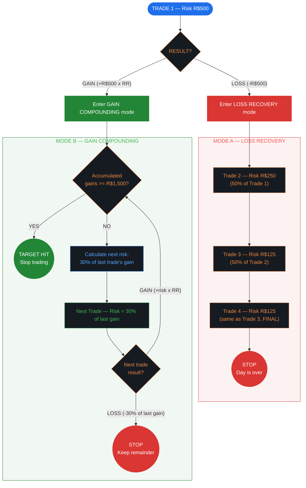
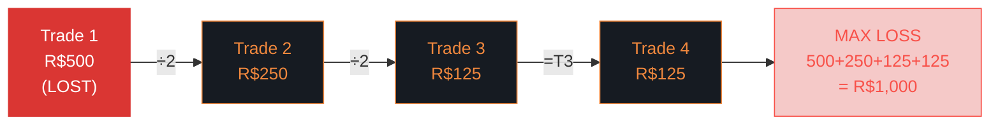
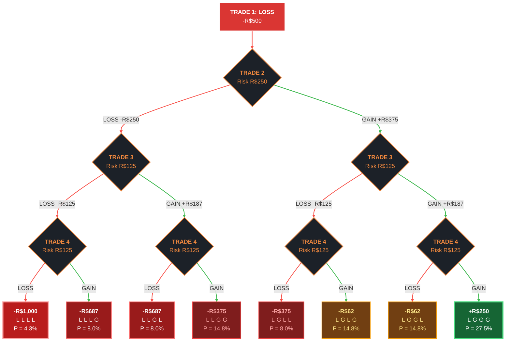
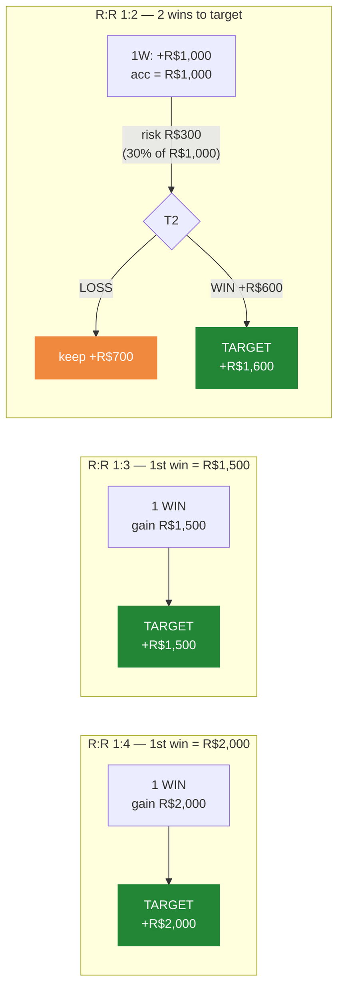

# Daily Trading Risk Management — Flowchart

> **Limits:** Per Trade R$500 | Daily R$1,000 | Weekly R$2,000 | Monthly R$7,500 | Hours 09:01–17:00
>
> **Execution Rules:** Minimum stop = 100 points | Maximum position = 20 contracts

---

## Main Decision Flow



---

## Loss Recovery — Size Reduction Sequence



**Rules:**
- Execute **all 4 trades** regardless of intermediate wins/losses
- After Trade 4 completes: **STOP for the day, no exceptions**
- Worst case = daily limit hit exactly (R$1,000)
- **Minimum stop: 100 points** — never use a stop smaller than this
- **Maximum position: 20 contracts** — never exceed this regardless of risk budget

### Position Sizing per Trade

```
Contracts = Risk Amount / (Stop in points * Point Value per contract)
```

| Trade | Risk    | Stop 100pt (R$0.20/pt) | Stop 150pt (R$0.20/pt) | Stop 200pt (R$0.20/pt) | Hard Cap |
|-------|---------|------------------------|------------------------|------------------------|----------|
| T1    | R$500   | 25 -> **20 (capped)**  | 16                     | 12                     | 20 max   |
| T2    | R$250   | 12                     | 8                      | 6                      | 20 max   |
| T3    | R$125   | 6                      | 4                      | 3                      | 20 max   |
| T4    | R$125   | 6                      | 4                      | 3                      | 20 max   |

*Example above uses WIN mini-index (R$0.20 per point per contract). Adjust point value for your instrument.*

> **If calculated contracts exceed 20: use 20 contracts and accept reduced risk.**
> **If stop < 100 points: widen stop to 100 points and reduce contracts.**

---

## Loss Recovery — All 8 Possible Paths (R:R 1:1.5, WR 65%)



> **Reading the tree:** Follow any path from top to bottom. Each branch is a LOSS (left, red) or GAIN (right, green).
> The bottom boxes show: **day result**, path pattern, and probability at 65% WR.
>
> - Only **path 8** (27.5%) ends positive (+R$250)
> - Paths 6-7 (29.6% combined) are near-breakeven (-R$62)
> - Path 1 (4.3%) is the worst case: daily limit hit (-R$1,000)
> - **Expected value of loss mode = -R$187.50**

---

## Gain Compounding — Paths by R:R (risk = 30% of last trade's gain)

Each subsequent trade after the first WIN risks **30% of the previous trade's gain**. On a loss you lose only that risk and keep the rest.



> **Key benefit of 30% rule:** You only risk 30% of the last win. Even on a compounding loss, you keep most of your gains.
>
> Higher R:R = fewer wins needed. At R:R ≥ 1:3, a single win hits the daily target immediately.
> At R:R 1:2, two wins does it. **Below R:R ~1:1.6, compounding alone cannot reach R$1,500** — gains converge to a ceiling.

---

## Quick Reference

```
TRADE 1 LOST?                          TRADE 1 WON?
─────────────                          ─────────────
1. Trade 2 at R$250                    1. Gains >= R$1,500? → STOP (target)
2. Trade 3 at R$125                    2. No? Next risk = 30% of last trade's gain
3. Trade 4 at R$125                    3. Lost? → STOP (keep 70% of gains)
4. STOP. Day over. No exceptions.      4. Won? → Back to step 1

ALWAYS CHECK BEFORE EVERY TRADE:
─────────────────────────────────
- Stop >= 100 points?      If not → widen stop, reduce contracts
- Contracts <= 20?          If not → cap at 20, accept less risk
- Within operating hours?   09:01–17:00 only
```
