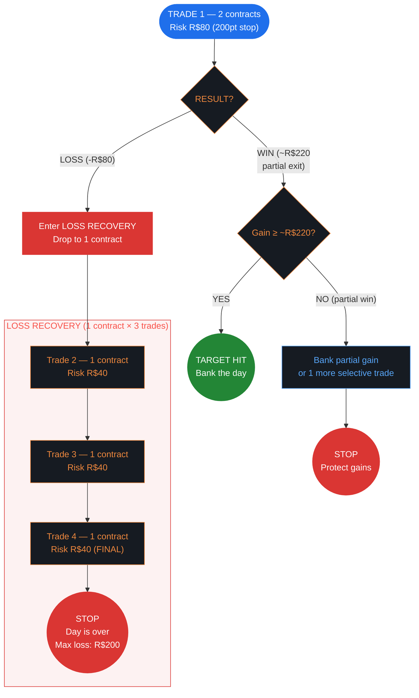
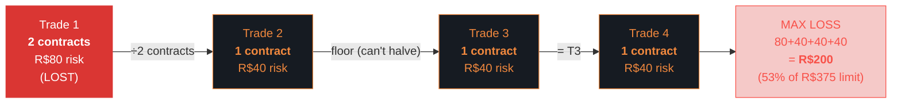
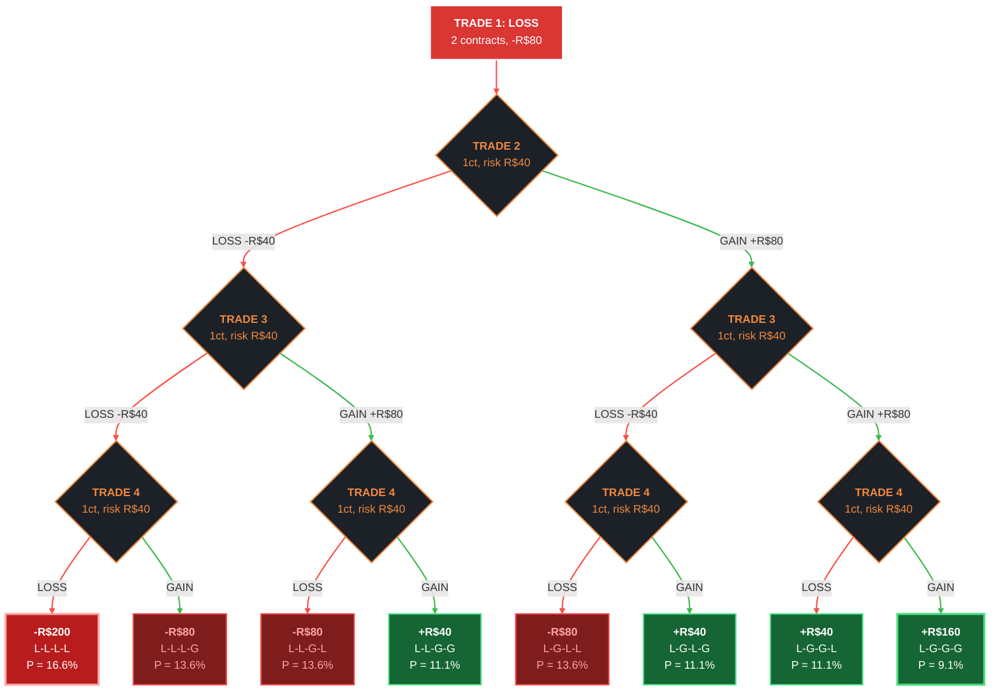
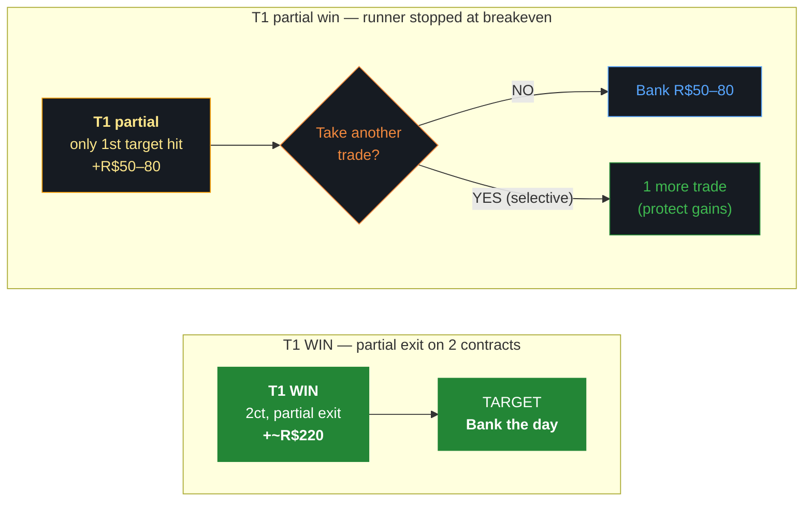
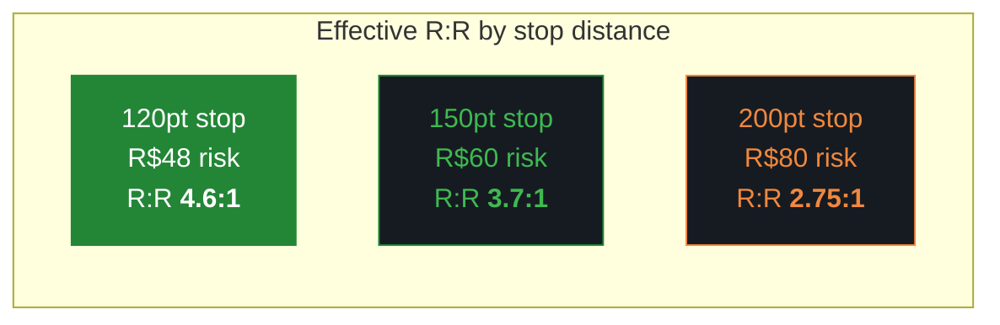
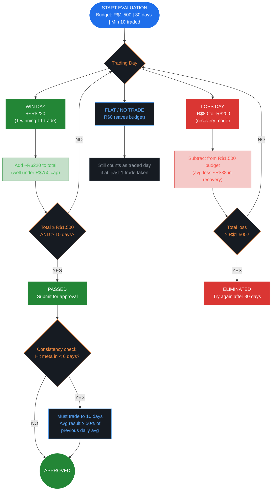

# TSR Iniciante — WIN Risk Management Flowchart

> **Plan:** Iniciante (FREE) | **Instrument:** WIN (Mini-Índice, R$0.20/pt/contract)
>
> **Limits:** Max 2 contracts | Daily Loss R$375 (TSR) / R$200 (ours) | Total Loss R$1,500 | Close 17:00
>
> **Our Config:** Max stop 200pt | T1 risk R$80 | Daily target **~R$220** (partial exit) | Cost R$0.60/ct/side

---

## Main Decision Flow



---

## Loss Recovery — Size Reduction (2 contracts → 1)



**Rules:**
- Execute **all 4 trades** regardless of intermediate wins/losses
- After Trade 4 completes: **STOP for the day, no exceptions**
- Worst case at 200pt = R$200 (53% of daily limit → **7 days to elimination**)
- **Minimum stop: 100 points** | **Maximum stop: 200 points** | **Maximum contracts: 2**

### Position Sizing per Trade (200pt stop)

```
Contracts = Risk Amount / (Stop × R$0.20)
```

| Trade | Contracts | Risk | Gain at R:R ~2:1 | Cost |
|-------|:---------:|:----:|:-----------:|:----:|
| T1 | **2** | R$80 | ~R$220 (partial exit) | R$2.40 |
| T2 | **1** | R$40 | ~R$80 | R$1.20 |
| T3 | **1** | R$40 | ~R$80 | R$1.20 |
| T4 | **1** | R$40 | ~R$80 | R$1.20 |

### Position Sizing at Other Stops

| Stop | T1 (2ct) | T2–T4 (1ct) | Max Daily Loss | Days to Elimination |
|------|:--------:|:-----------:|:--------------:|:-------------------:|
| 120 pt | R$48 | R$24 | R$120 | 12 |
| 150 pt | R$60 | R$30 | R$150 | 10 |
| 180 pt | R$72 | R$36 | R$180 | 8 |
| 200 pt | **R$80** | **R$40** | **R$200** | **7** |

---

## Loss Recovery — All 8 Paths (200pt, recovery R:R ~2:1, WR 45%)



> **Reading the tree:** Follow any path top to bottom. Left/red = LOSS, right/green = GAIN.
>
> - **4 of 8 paths end positive** (+R$40 to +R$160) — 42.4% combined probability
> - **3 paths are moderate losses** (-R$80 each) — 40.8% combined
> - **Only 1 path hits full daily loss** (-R$200) — 16.6% probability
> - **E[Loss Mode] = -R$38** — average cost of entering recovery. Manageable.

---

## Gain Mode — One Trade to Target

Unlike the base system (3 consecutive wins needed), here **1 winning T1 trade ≈ daily target**.



> **No compounding, no 30% rule, no multi-win sequences.** One setup, one partial exit, one target.
> If runner fails (partial win R$50–80), banking the gain is often the right call.

---

## Gain by Stop Distance (T1 partial exit, ~R$220 max gain)



> **Tighter stops = better R:R.** The partial exit gain (~R$220) is based on target distances, not stop size.
> At 150pt: R:R 3.7:1. At 200pt (worst case): still 2.75:1. Both are excellent.

---

## Evaluation Roadmap — 30 Days to R$1,500



> **Realistic path to pass (200pt stop, Approach A):**
> - ~9 winning days × R$220 avg = R$1,980
> - ~5 losing days × R$100 avg = -R$500
> - Net ≈ **+R$1,480** → borderline, need 1 more good day or smaller losses
> - At 55%+ WR: ~13 trading days to pass
> - Budget consumed on losses: R$500 of R$1,500 → **67% budget remaining**

---

## Quick Reference

```
═══════════════════════════════════════════════════
  TSR INICIANTE — WIN — DECISION FLOWCHART
═══════════════════════════════════════════════════

  BEFORE MARKET OPEN
  ──────────────────
  □ Daily loss budget: R$200 (4 levels, within R$375)
  □ Remaining total budget: R$1,500 - losses so far
  □ Plan: 2 contracts on T1, 1 contract on recovery

  TRADE 1 (2 contracts, max 200pt stop)
  ──────────────────────────────────────
  WIN (~R$220 partial exit) → STOP, bank the day
  PARTIAL WIN (R$50–80) → bank it or 1 more trade
  LOSS (-R$80) → RECOVERY MODE

  LOSS RECOVERY (1 contract × 3 trades)
  ──────────────────────────────────────
  T2: 1 contract, R$40 risk          Max daily loss:
  T3: 1 contract, R$40 risk          R$80+40+40+40
  T4: 1 contract, FINAL              = R$200
  STOP. Day over.

  BEFORE EVERY TRADE:
  ─────────────────────────────────
  □ Stop >= 100 points?
  □ Stop <= 200 points?
  □ Contracts <= 2?
  □ Still within daily loss limit?
  □ Before 17:00?

  KEY NUMBERS AT 200pt STOP
  ─────────────────────────
  T1 risk:           R$80 (2 contracts)
  T1 gain:           ~R$220 (partial exit)
  Recovery risk:     R$40 (1 contract)
  Recovery gain:     ~R$80 (at R:R 2:1)
  Max daily loss:    R$200 (4 levels)
  Days to elim:      7 worst-case
  Daily target:      ~R$220 (1 winning T1)
  Cost per trade:    R$2.40 (2ct) / R$1.20 (1ct)

═══════════════════════════════════════════════════
```
