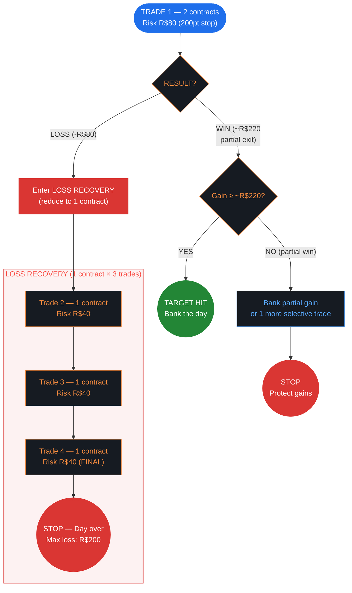
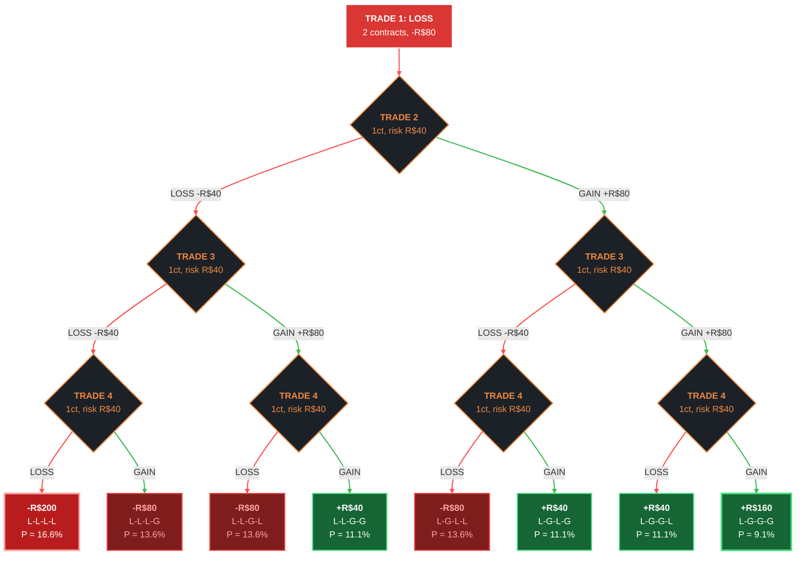

# TSR Iniciante — WIN Risk Management Adaptation

> Our risk management system adapted for the TSR Iniciante evaluation plan.
> Instrument: **WIN (Mini-Índice)** — R$0.20 per point per contract.
> **Profit targets: OURS (not TSR's referência diária).**

---

## 1. Constraints at a Glance

| Rule | Our Base System | TSR Iniciante (our config) | Impact |
|------|:---:|:---:|--------|
| Max Contracts | 20 | **2** | Severe — limits risk per trade |
| Max Stop | — | **200 points** (our limit) | Won't trade wider stops |
| Per Trade Risk (T1) | R$500 | **R$80** (2ct × 200pt) | 84% reduction |
| Daily Loss (ours) | R$1,000 | **R$200** (4 levels: 80+40+40+40) | Well within TSR's R$375 stopper |
| Daily Loss (TSR limit) | — | R$375 (stopper) | Our R$200 leaves 47% margin |
| Total Loss (period) | R$7,500/month | **R$1,500/30 days** | Equals the meta! |
| Daily Gain Target | R$1,500 | **~R$220** (1 winning T1 trade) | Achievable in a single trade |
| Operating Hours | 09:01–17:00 | Close at 17:00 | Same |
| Costs per trade | — | R$0.60/contract/side | R$2.40 round trip at 2 contracts |

### The Three Critical Facts

1. **2 contracts maximum** — Only 1 or 2 contracts per trade. Anti-martingale becomes **2→1→1→1**.

2. **Perda Total = Meta = R$1,500** — Your loss budget IS your profit target. Every loss day eats into both.

3. **One winning trade = daily target** — Our partial exit on 2 contracts yields ~R$220, which IS our daily target. No multi-trade compounding needed.

---

## 2. WIN Position Sizing

```
Risk = Contracts × Stop (points) × R$0.20
```

| Stop | 2 Contracts (T1) | 1 Contract (Recovery) | Notes |
|------|:---:|:---:|-------|
| 120 pt | R$48 | R$24 | Lower end |
| 150 pt | R$60 | R$30 | Common |
| 180 pt | R$72 | R$36 | |
| 200 pt | **R$80** | **R$40** | **Max — reference for all calculations** |

> At max 200pt stop: T1 risks R$80, recovery trades risk R$40.
> Our R$200 max daily loss is only 53% of TSR's R$375 limit — significant safety margin.

---

## 3. Loss Recovery: Anti-Martingale 2→1→1→1

When T1 loses, enter recovery mode with reduced position.

```
T1: 2 contracts → LOSS (-R$80) → enter recovery
T2: 1 contract  (halved — only reduction possible with 2ct max)
T3: 1 contract  (floor — can't go below 1)
T4: 1 contract  (FINAL trade)
STOP. Day over. No exceptions.
```

| Stop | T1 (2ct) | T2 (1ct) | T3 (1ct) | T4 (1ct) | **Max Daily** | % of R$375 | Days to Elim |
|------|:---:|:---:|:---:|:---:|:---:|:---:|:---:|
| 120 pt | R$48 | R$24 | R$24 | R$24 | R$120 | 32% | 12 |
| 150 pt | R$60 | R$30 | R$30 | R$30 | R$150 | 40% | 10 |
| 180 pt | R$72 | R$36 | R$36 | R$36 | R$180 | 48% | 8 |
| 200 pt | **R$80** | **R$40** | **R$40** | **R$40** | **R$200** | 53% | **7** |

> At 200pt max stop: **7 worst-case days** before elimination.
> Execute all 4 trades regardless of intermediate results. After T4: STOP, no exceptions.

### Alternative Approaches (for reference)

| Approach | Pattern | Max Daily (200pt) | Days to Elim | Pros | Cons |
|----------|---------|:---:|:---:|------|------|
| **A: Anti-Martingale** | 2→1→1→1 | **R$200** | **7** | Balanced risk/runway | Standard choice |
| B: Flat Multi | 2→2→2→2 | R$320 | 4 | More full-size attempts | Burns budget 2× faster |
| C: Progressive | 1→1→2 | R$160 | 9 | Maximum runway (9 days) | T1 gain halved (1ct, no partial exit) |

> **Approach A is our default.** Best balance of capital preservation and earning potential.

---

## 4. Gain Mode: One Trade to Target

Our partial exit strategy on 2 contracts yields **~R$220** — which IS the daily target.

```
T1 WIN (partial exit: 1ct at first target + 1ct runner) → ~R$220 → TARGET → STOP
```

### Why This Simplifies Everything

In the base system (R$500 risk → R$1,500 target), you need 3 consecutive wins with 30% compounding. Here, **one winning trade does it:**

| Scenario | Result | Action |
|----------|--------|--------|
| T1 wins — full partial exit | **~R$220** | TARGET → STOP for the day |
| T1 wins — runner stopped at breakeven | ~R$50–80 | Bank it, or take 1 more selective trade |
| T1 loses | -R$80 | Enter recovery (3 more trades at 1ct) |

### Gain by Stop Distance (T1 at 2 contracts, partial exit)

The partial exit gain (~R$220) depends on the target distances, not the stop. But effective R:R improves at tighter stops:

| Stop | Risk (2ct) | Gain (~R$220) | Effective R:R |
|------|:---:|:---:|:---:|
| 120 pt | R$48 | ~R$220 | 4.6:1 |
| 150 pt | R$60 | ~R$220 | 3.7:1 |
| 180 pt | R$72 | ~R$220 | 3.1:1 |
| 200 pt | R$80 | ~R$220 | 2.75:1 |

> Tighter stops = better R:R. At 150pt: effective 3.7:1. At 200pt (worst case): still 2.75:1.
> No compounding, no multi-win sequences. One trade, one target.

---

## 5. Evaluation Strategy

### The Math of Passing

| Factor | Value |
|--------|-------|
| Meta Aprovação | R$1,500 |
| Our daily target | **~R$220** (1 winning T1, partial exit) |
| Max countable per day (50% rule) | R$750 — our R$220 fits easily |
| No single day > 50% of meta | R$750 cap — R$220 is only 14.7% |
| Minimum trading days | 10 |
| Evaluation period | 30 calendar days (~22 trading days) |
| Our max daily loss | R$200 (Approach A at 200pt) |

**Minimum winning days to pass (zero losses):** ceil(1500/220) = **7 target days**

**With losses factored in:**

```
Σ(winning days) - Σ(losing days) ≥ R$1,500
```

### Expected Performance by Win Rate

Recovery trades at 1 contract (R$40 risk) assume R:R ~2:1 (gain ~R$80). T1 at 2 contracts: R$80 risk, ~R$220 gain.

| Trade WR | E[Loss Mode Day] | E[Daily P&L] | Days to R$1,500 | Feasible? |
|----------|:---:|:---:|:---:|:---:|
| 45% | -R$38 | ~R$78 | ~19 trading days | Tight but possible |
| 50% | -R$20 | ~R$100 | ~15 trading days | Doable |
| 55% | -R$2 | ~R$120 | ~13 trading days | Good |
| 60% | +R$16 | ~R$138 | ~11 trading days | Comfortable |

> At 50%+ trade WR, the math works within the 30-day window.
> Even at 45% WR, loss-mode recovery keeps average loss days manageable (~R$38).

### Scenarios to Pass (200pt stop, Approach A)

| Scenario | Win Days | Avg Gain | Loss Days | Avg Loss | Net | Pass? |
|----------|:---:|:---:|:---:|:---:|:---:|:---:|
| Strong | 9 | R$220 | 3 | R$80 | +R$1,740 | YES |
| Good | 10 | R$200 | 4 | R$100 | +R$1,600 | YES |
| Realistic | 9 | R$200 | 5 | R$100 | +R$1,300 | CLOSE |
| Tight | 8 | R$220 | 4 | R$120 | +R$1,280 | NO — need more days |

> You need roughly **65%+ win-day rate** over 12–15 traded days.
> Losing days are controlled (R$80–R$200). The key is consistent R$200+ winning days.

### Consistency Proof Requirements

If you hit R$1,500 in fewer than 6 days:
- Must continue to 10 trading days
- Remaining days must average ≥ 50% of the average that got you to the meta

**Example:** Hit R$1,500 in 7 days (avg R$214/day) → remaining 3 days must average ≥ R$107/day

> With R$220 per winning day, no single day dominates. This naturally satisfies the consistency proof — the 50% rule cap (R$750) is never close to being hit.

---

## 6. Cost Impact

| Trade Type | Contracts | Cost | As % of R$80 risk |
|------------|:---:|:---:|:---:|
| T1 (2 contracts) | 2 | R$2.40 | 3.0% |
| Recovery (1 contract) | 1 | R$1.20 | 3.0% |

### Full-day cost scenarios

| Day Type | Trades | Total Cost | Impact |
|----------|:---:|:---:|--------|
| Win day — T1 hits target | 2 cts | R$2.40 | 1.1% of R$220 |
| Win day — T1 + 1 recovery | ~3 cts | R$3.60 | 1.6% of R$220 |
| Loss recovery (4 trades) | 2+1+1+1 = 5 cts | R$6.00 | Adds R$6 to R$200 max loss |

### 30-day cost projection

| Scenario | Trades/Day | Daily Cost | 22-Day Total | As % of R$1,500 meta |
|----------|:---:|:---:|:---:|:---:|
| Selective (1–2 trades) | 2 avg | R$3.60 | R$79 | 5.3% |
| Normal (2–4 trades) | 3 avg | R$4.80 | R$106 | 7.0% |
| Active (4+ trades) | 5 avg | R$7.20 | R$158 | 10.5% |

> **One-trade win days cost just R$2.40.** Huge advantage of the single-trade target.
> Selective, high R:R trading is the most cost-efficient path.

---

## 7. Decision Flowchart



---

## 8. Loss Recovery — All 8 Paths (200pt stop, recovery R:R ~2:1, WR 45%)

With 2→1→1→1 at 200pt stop:
- T1: 2 contracts, risk R$80 (always LOSS in this tree)
- T2–T4: 1 contract each, risk R$40, estimated gain ~R$80 (R:R ~2:1)

> **Note:** Recovery gain of R$80 assumes R:R ~2:1 for 1-contract trades (target ~400pt from entry). Adjust if your 1-contract exit strategy differs.



| Path | T1 | T2 | T3 | T4 | **Day Result** | Probability |
|------|---:|---:|---:|---:|:---:|:---:|
| L-L-L-L | -80 | -40 | -40 | -40 | **-R$200** | 16.6% |
| L-L-L-G | -80 | -40 | -40 | +80 | **-R$80** | 13.6% |
| L-L-G-L | -80 | -40 | +80 | -40 | **-R$80** | 13.6% |
| L-L-G-G | -80 | -40 | +80 | +80 | **+R$40** | 11.1% |
| L-G-L-L | -80 | +80 | -40 | -40 | **-R$80** | 13.6% |
| L-G-L-G | -80 | +80 | -40 | +80 | **+R$40** | 11.1% |
| L-G-G-L | -80 | +80 | +80 | -40 | **+R$40** | 11.1% |
| L-G-G-G | -80 | +80 | +80 | +80 | **+R$160** | 9.1% |

> **4 of 8 paths** end negative, **4 of 8** end positive (including 3 at +R$40 and 1 at +R$160).
> Only path 1 (16.6%) hits the full daily loss of R$200.
>
> **E[Loss Mode] = -R$38** — average cost of a T1-loss day. Manageable.
>
> With higher recovery R:R (e.g., 3:1 → gain R$120), E[Loss Mode] improves to ~+R$16.

---

## 9. Quick Reference Card

```
═══════════════════════════════════════════════
  TSR INICIANTE — WIN — QUICK REFERENCE
═══════════════════════════════════════════════

  HARD LIMITS
  ─────────────────────────────────
  Max contracts:    2
  Max stop:         200 points (our rule)
  Daily loss (TSR): R$375 (stopper)
  Daily loss (ours):R$200 (4 levels)
  Total loss:       R$1,500 (elimination = meta)
  Evaluation:       30 days, min 10 traded
  Close:            17:00 (forced)
  Cost:             R$0.60/contract/side

  TRADE 1 WON?                     TRADE 1 LOST?
  ──────────────                    ───────────────
  ~R$220 (partial exit)?            1. T2: 1 contract (R$40 risk)
  YES → STOP, bank the day         2. T3: 1 contract (R$40 risk)
  NO  → bank partial or            3. T4: 1 contract (FINAL)
        1 more selective trade      4. STOP. Day over.

  BEFORE EVERY TRADE:
  ─────────────────────────────────
  □ Stop >= 100 points?
  □ Stop <= 200 points?
  □ Contracts <= 2?
  □ Still within daily loss limit?
  □ Before 17:00?

  KEY NUMBERS AT 200pt STOP
  ─────────────────────────
  T1 risk:           R$80 (2 contracts)
  T1 gain:           ~R$220 (partial exit)
  Recovery risk:     R$40 (1 contract)
  Max daily loss:    R$200 (4 levels)
  Days to elim:      7 worst-case
  Daily target:      ~R$220 (1 winning T1)
  Cost per trade:    R$2.40 (2ct) / R$1.20 (1ct)

═══════════════════════════════════════════════
```

---

## 10. Key Takeaways

### What Changes from Our Base System

1. **One trade = daily target.** Our partial exit on 2 contracts yields ~R$220, which IS our daily target. No compounding, no multi-win sequences. This dramatically simplifies gain mode.

2. **R$80 max risk per trade.** At our 200pt max stop with 2 contracts. Recovery trades at 1 contract risk R$40. Our worst day (R$200) is well within TSR's R$375 stopper.

3. **Capital preservation is critical.** Total loss = meta = R$1,500. With R$200 max daily loss, you get **7 worst-case days** before elimination. Every unnecessary loss day eats directly into your target.

4. **The 50% evaluation cap (R$750) is irrelevant to us.** Our R$220 target is only 14.7% of the meta — the consistency proof is automatically satisfied. No single day can dominate.

5. **Costs are minimal at 1–2 trades/day.** A one-trade winning day costs just R$2.40 (1.1% of R$220). The single-trade target minimizes cost drag vs. multi-trade compounding.

### The Ideal Iniciante Profile

| Parameter | Recommended |
|-----------|-------------|
| Max Stop | **200 points** |
| T1 Setup | 2 contracts, partial exit targeting ~R$220 |
| Loss Recovery | Approach A (2→1→1→1) |
| Gain Target per Day | **~R$220** (1 winning T1 trade) |
| Trading Style | Patient, selective, 1–2 trades/day |
| Required WR | ~50%+ trade win rate |

### Why Iniciante is Hard but Possible

- **Hard:** R$220/day × 7+ winning days needed. At 50% WR you need ~15 trading days to pass. Budget is tight — 7 worst-case days to elimination means no room for extended losing streaks.
- **Possible:** One winning trade = daily target. No need for consecutive wins or compounding luck. Loss mode averages only -R$38/day (at R:R 2:1 recovery). At 55%+ WR, you pass in ~13 trading days with room to spare.
- **The edge:** This plan rewards *selectivity* — wait for the right setup, take T1, hit the partial exit, stop. Every extra trade is cost and risk that doesn't need to happen.
